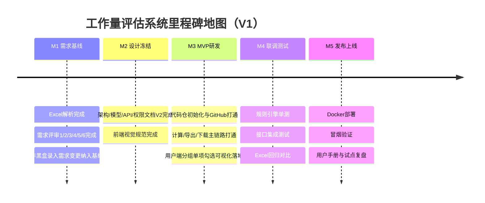
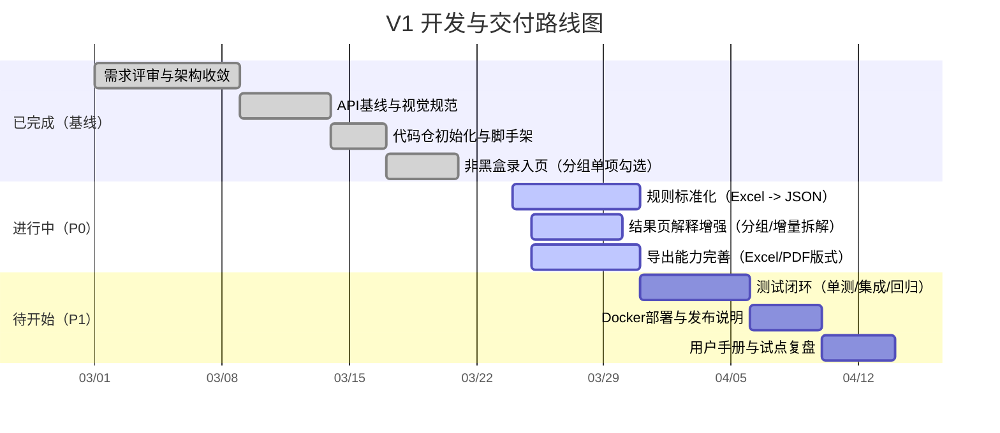
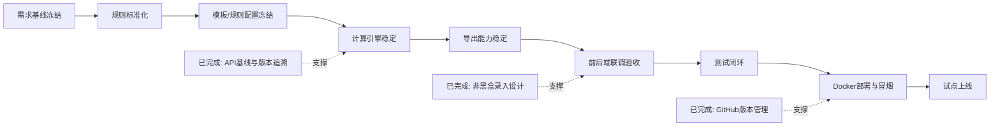
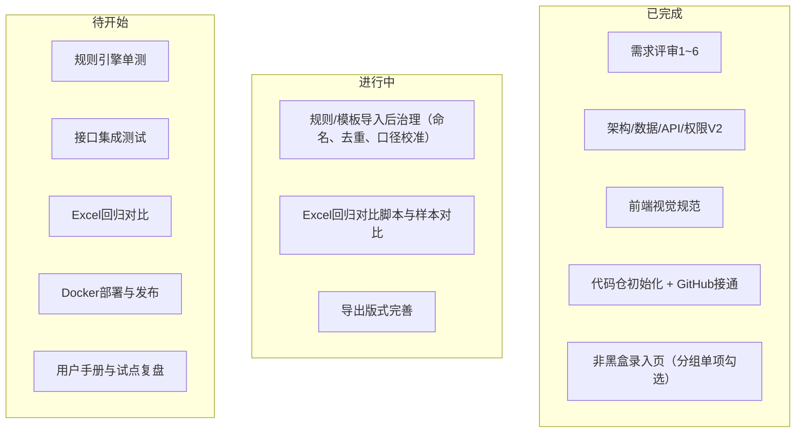

# 工作量评估系统 - 项目开发 TODO List

## 0. 项目初始化
- [x] 完成 Excel 原型结构解析（工作表、字段、公式、约束）
- [x] 建立项目规范目录结构（需求/设计/开发/测试/发布/运维）
- [x] 明确 MVP 范围与一期交付边界（计算 + 导出，不做复杂存储）
- [x] 约定文档命名规范与版本号规则（核心设计文档已统一 V2）
- [x] 完成编码前全量文档巡检与一致性校对
- [x] 建立对话流程总结机制（里程碑持续更新）

## 1. 需求与规则梳理
- [x] 固化业务对象清单（模板、分组、估算项、规则、会话）
- [x] 完成需求评审 1（产品目标层）并形成结论
- [x] 完成需求评审 2（业务能力层）并形成结论
- [x] 完成需求评审 3（评估流程层）并形成结论
- [x] 完成需求评审 4（计算规则层）并形成结论
- [x] 完成需求评审 6（接口与技术层）并形成结论（见 `API接口设计-V2.md` §14）
- [x] 完成 Excel 规则标准化（用户数分段、难度系数、多组织系数，含抽取脚本）
- [x] 区分可配置规则与硬编码规则（核心规则改为参数化/规则化）
- [ ] 输出需求基线 V1（含非功能需求）

## 2. 架构设计（当前进行中）
- [x] 输出总体架构设计初稿（前端/后端/数据/规则引擎/部署）
- [x] 明确技术栈与版本（前端、后端、数据库）
- [x] 完成数据模型设计（精简存储，文件化为主）
- [x] 完成 API 设计（估算、模板、规则、导出）
- [x] 完成权限模型设计（admin/operator 最小 RBAC）
- [x] 完成轻量化架构收敛（移除项目/快照主流程）
- [x] 完成核心文档 Mermaid 可视化补充（架构/模型/API/实施）

## 3. 产品与交互设计
- [x] 完成需求评审 5（页面与交互层）并形成结论
- [x] 输出前端视觉规范（Calendly 风格 + 本地参考图）
- [x] 设计信息架构（页面导航与功能分区）
- [x] 输出估算录入页原型（模板分组/单项可视化勾选 + 实时回算）
- [x] 输出规则配置页原型（分段规则、系数规则，只读摘要面板）
- [x] 输出结果页原型（总计、增量拆解、分组/单项明细、requestId/JSON复制）
- [x] 需求变更：用户端非黑盒录入（展示 `group -> item` 全量结构并支持逐项勾选/反勾选）

## 4. 开发实现（MVP）
- [x] 初始化代码仓（已本地初始化 Git、接入 GitHub 远程并完成 main 首次推送）
- [x] 完成模板/规则导入能力（从 Excel 或 JSON，已提供 API 导入端点）
- [x] 完成估算计算引擎（支持分组小计、增量拆解、requestId追溯）
- [x] 完成规则引擎 pipeline 化（grouping/item/base/orgIncrement 可配置）
- [x] 完成会话态估算流程（不落库，含 `sessions/start` 与会话计算）
- [x] 完成结果导出（Excel/PDF，含幂等键回放）
- [x] 完成最小访问控制（可选，Header `X-Role` 版 RBAC）
- [x] 输出开发实施清单与工程脚手架方案
- [x] 输出编码前总览报告与开工确认清单

## 5. 测试与质量
- [ ] 编写规则引擎单元测试（覆盖关键公式和边界值）
  - [x] 已完成首版规则引擎单元测试：`npm run test:rules`（用户分段、取整、难度、多组织、分组小计、缺失项校验）
- [ ] 编写接口集成测试（核心 API）
  - [x] 已完成首版 API 集成校验脚本：`npm run test:api:integration`（health/templates/rule-set/calculate/export-idempotency）
- [ ] 执行业务回归（与原 Excel 结果对比）
  - [x] 已完成首版回归脚本与报告：`npm run rules:excel-report`（输出到 `05_测试与质量/测试报告`）
- [ ] 完成性能与稳定性验证（并发计算、导出）

## 6. 发布与部署
- [ ] 准备 Docker 部署方案（单机轻量）
- [ ] 准备环境配置模板（dev/prod）
- [ ] 准备发布与回滚说明
- [ ] 完成首版部署与冒烟验证

## 7. 交付与运营
- [ ] 输出用户手册与管理员手册
- [ ] 输出试点项目复盘报告
- [ ] 收集优化项并规划 V1.1 迭代

---

## 近期两周重点（建议）
1. 需求规则固化（优先级 P0）
2. 轻量存储方案落地（模板/规则文件化）（优先级 P0）
3. MVP 计算 + 导出主流程闭环（优先级 P0）
4. Docker 单机部署跑通（优先级 P1）

---

## 里程碑地图（可视化）

### 1) 总体里程碑时间线

### 2) 研发推进甘特图（建议）

### 3) 关键路径流转图（从需求到上线）

### 4) 当前任务看板（状态视图）

