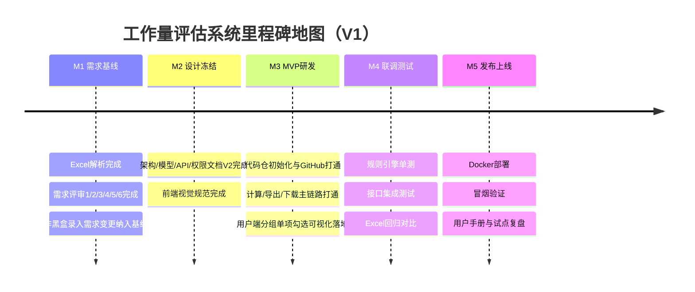
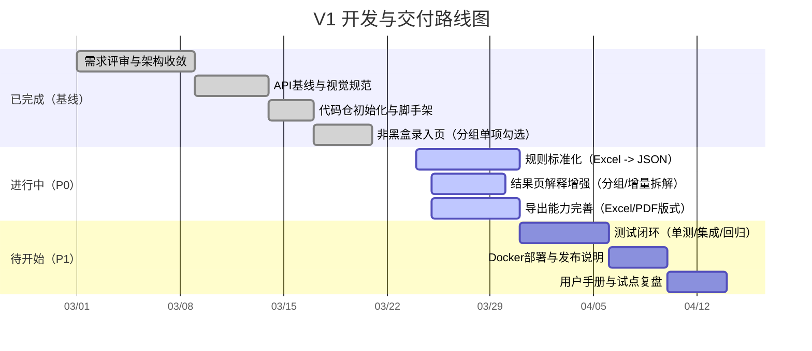
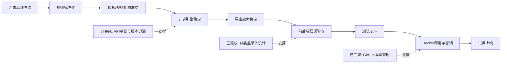
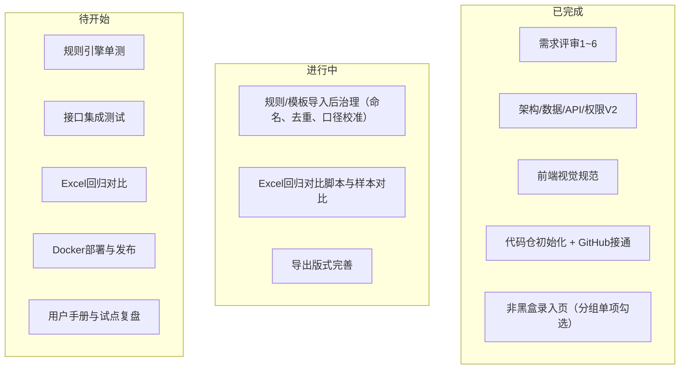

# 工作量评估系统 - 项目开发 TODO List

## 0. 项目初始化
- [x] 完成 Excel 原型结构解析（工作表、字段、公式、约束）
- [x] 建立项目规范目录结构（需求/设计/开发/测试/发布/运维）
- [x] 明确 MVP 范围与一期交付边界（计算 + 导出，不做复杂存储）
- [x] 约定文档命名规范与版本号规则（核心设计文档已统一 V2）
- [x] 完成编码前全量文档巡检与一致性校对
- [x] 建立对话流程总结机制（里程碑持续更新）

## 1. 需求与规则梳理
- [x] 固化业务对象清单（模板、分组、估算项、规则、会话）
- [x] 完成需求评审 1（产品目标层）并形成结论
- [x] 完成需求评审 2（业务能力层）并形成结论
- [x] 完成需求评审 3（评估流程层）并形成结论
- [x] 完成需求评审 4（计算规则层）并形成结论
- [x] 完成需求评审 6（接口与技术层）并形成结论（见 `API接口设计-V2.md` §14）
- [x] 完成 Excel 规则标准化（用户数分段、难度系数、多组织系数，含抽取脚本）
- [x] 区分可配置规则与硬编码规则（核心规则改为参数化/规则化）
- [ ] 输出需求基线 V1（含非功能需求）

## 2. 架构设计（当前进行中）
- [x] 输出总体架构设计初稿（前端/后端/数据/规则引擎/部署）
- [x] 明确技术栈与版本（前端、后端、数据库）
- [x] 完成数据模型设计（精简存储，文件化为主）
- [x] 完成 API 设计（估算、模板、规则、导出）
- [x] 完成权限模型设计（admin/operator 最小 RBAC）
- [x] 完成轻量化架构收敛（移除项目/快照主流程）
- [x] 完成核心文档 Mermaid 可视化补充（架构/模型/API/实施）

## 3. 产品与交互设计
- [x] 完成需求评审 5（页面与交互层）并形成结论
- [x] 输出前端视觉规范（Calendly 风格 + 本地参考图）
- [x] 设计信息架构（页面导航与功能分区）
- [x] 输出估算录入页原型（模板分组/单项可视化勾选 + 实时回算）
- [x] 输出规则配置页原型（分段规则、系数规则，只读摘要面板）
- [x] 输出结果页原型（总计、增量拆解、分组/单项明细、requestId/JSON复制）
- [x] 需求变更：用户端非黑盒录入（展示 `group -> item` 全量结构并支持逐项勾选/反勾选）

## 4. 开发实现（MVP）
- [x] 初始化代码仓（已本地初始化 Git、接入 GitHub 远程并完成 main 首次推送）
- [x] 完成模板/规则导入能力（从 Excel 或 JSON，已提供 API 导入端点）
- [x] 完成估算计算引擎（支持分组小计、增量拆解、requestId追溯）
- [x] 完成规则引擎 pipeline 化（grouping/item/base/orgIncrement 可配置）
- [x] 完成会话态估算流程（不落库，含 `sessions/start` 与会话计算）
- [x] 完成结果导出（Excel/PDF，含幂等键回放）
- [x] 完成最小访问控制（曾用 Header `X-Role` 版 RBAC；**当前已升级为 JWT**，以代码为准，见 `03_技术设计/系统演进/实现与文档对齐说明.md`）
- [x] 输出开发实施清单与工程脚手架方案
- [x] 输出编码前总览报告与开工确认清单

## 5. 测试与质量
- [ ] 编写规则引擎单元测试（覆盖关键公式和边界值）
  - [x] 已完成首版规则引擎单元测试：`npm run test:rules`（用户分段、取整、难度、多组织、分组小计、缺失项校验）
- [ ] 编写接口集成测试（核心 API）
  - [x] 已完成首版 API 集成校验脚本：`npm run test:api:integration`（health/templates/rule-set/calculate/export-idempotency）
- [ ] 执行业务回归（与原 Excel 结果对比）
  - [x] 已完成首版回归脚本与报告：`npm run rules:excel-report`（输出到 `05_测试与质量/测试报告`）
- [ ] 完成性能与稳定性验证（并发计算、导出）

## 6. 发布与部署
- [ ] 准备 Docker 部署方案（单机轻量）
- [ ] 准备环境配置模板（dev/prod）
- [ ] 准备发布与回滚说明
- [ ] 完成首版部署与冒烟验证

## 7. 交付与运营
- [ ] 输出用户手册与管理员手册
- [ ] 输出试点项目复盘报告
- [ ] 收集优化项并规划 V1.1 迭代
- [ ] 新增“团队协同与角色化工作台”能力专项（未来需求，V2候选）：
  - [ ] 建立团队组织模型（团队、成员、角色、归属关系）
  - [ ] 角色体系首版：`部门负责人`、`实施顾问`、`售前顾问`、`销售顾问`
  - [ ] 支持跨角色组建团队与成员管理（加入/移除/角色调整）
  - [ ] 部门负责人可查看本团队下全部评估方案（列表、状态、负责人、进度）
  - [ ] 支持围绕“总方案”的评审、评论与协同流转（含意见留痕）
  - [ ] 评审协同需保留最小审计字段（谁在何时做了什么）
- [ ] 新增“AI 友好调用”能力专项（Agent-Friendly API）：
  - [ ] P0（MVP，优先两周内完成）
    - [ ] 设计并实现高层估算入口 `POST /api/v1/agent/estimate`（后端托管模板/规则上下文，减少必填参数）
    - [ ] 内置参数补全与容错（userCount/orgCount/difficultyFactor 缺省回填与边界修正）
    - [ ] 输出统一“可解释反馈”结构（`missingFields` / `assumptions` / `nextQuestions`）
    - [ ] 提供最小会话态能力（`sessionId` + `contextSummary`），支持 Agent 多轮追问
    - [ ] 新增 10+ 条 Agent 集成测试样例（缺参、错参、追问补全、成功估算）
    - [ ] W1（接口与后端能力）
      - [ ] 后端：实现 `POST /api/v1/agent/estimate` 与 `POST /api/v1/agent/session/start`
      - [ ] 后端：参数补全器（默认值、边界值、非法值修正）与标准错误映射
      - [ ] 后端：响应结构统一（success / needs_clarification / failed）
      - [ ] 测试：新增单测（补全逻辑、缺参逻辑、冲突参数逻辑）
    - [ ] W2（联调与可用性验收）
      - [ ] 后端：实现 `POST /api/v1/agent/session/:sessionId/continue`
      - [ ] 前端：新增 Agent 调试页（输入自然语言 -> 查看结构化响应）
      - [ ] 测试：完成 10+ 条端到端场景回归（多轮追问、补问收敛、估算成功）
      - [ ] 文档：输出 Agent 调用示例会话（成功路径 + 异常路径）
    - [ ] 角色分工（建议）
      - [ ] 后端负责人：接口设计、补全与校验、会话上下文、可解释响应
      - [ ] 前端负责人：Agent 调试页、可视化反馈面板、会话追踪展示
      - [ ] 测试负责人：场景用例库、稳定性回归、失败分类统计
  - [ ] P1（增强）
    - [ ] 增加意图解析层（自然语言 -> 模板/工作表/条目候选）
    - [ ] 增加“候选项确认”接口（返回 topK 候选 + 置信度 + 解释）
    - [ ] 增加“自动补全建议”接口（面向 Agent 的下一问建议）
    - [ ] 对导出链路增加 Agent 友好返回（结构化下载信息 + 可读说明）
  - [ ] P2（体验优化）
    - [ ] 增加反馈闭环（用户确认结果反哺，优化映射规则）
    - [ ] 建立 Agent 调用质量看板（成功率、补问次数、平均回合数、失败原因）
    - [ ] 沉淀 Agent 契约版本治理（兼容策略、弃用策略、变更公告）

---

## 近期两周重点（建议）
1. 需求规则固化（优先级 P0）
2. 轻量存储方案落地（模板/规则文件化）（优先级 P0）
3. MVP 计算 + 导出主流程闭环（优先级 P0）
4. Docker 单机部署跑通（优先级 P1）

## 近期状态对齐（2026-03）

- [x] 前端已完成多页签评估流程主链路：需求导入、实施评估、开发评估、资源人天及成本、总览联动
- [x] 已完成“评估方案列表”与方案预览弹窗（关联关系图 + 基本分析 + 子评估摘要）
- [x] 已完成总方案版本（`GL-`）与子版本（`PG-`/`RI-`/`DV-`/`RS-`）关联保存与回填
- [x] 已完成账号体系（注册/登录/JWT）与管理员能力（用户管理、推荐码管理）
- [x] 已完成按用户维度的数据隔离（草稿、导出、下载鉴权）
- [ ] 待完善：部署发布链路（Docker 与环境模板）及运维文档固化

---

## 今日推进（2026-03-30）

- [x] 回归校验通过：`npm run test:modules`、`npm run test:api:agent`
- [x] 日志窗口统计可用：`npm run logs:api:report`（支持 `--window=10m/1h/all`）
- [x] 团队协同 P0 评审结论：`01_需求管理/需求分析/团队协同-P0需求评审结论.md`
- [x] 团队协同 PRD 草案：`01_需求管理/需求分析/团队协同与角色化工作台-PRD草案.md`
- [x] 团队协同技术方案草图：`03_技术设计/系统架构/团队协同能力-技术方案草图.md`
- [x] 团队协同后端骨架：`apps/api/src/modules/team/*` + `apps/api/src/routes/team.routes.ts`
- [x] 团队协同后端测试：`modules.usecase.test.ts` 新增 3 条（权限/隔离/状态流转）
- [x] 对齐验证通过：`npm run build:api`、`npm run test:modules`
- [x] 团队协同接口契约对齐：`docs/openapi.yaml`（Teams 路径 + 当前错误语义）
- [x] 团队协同联调文档与全链路 curl：`docs/LLM_API_CALLING_GUIDE.md`
- [x] 团队协同自动化冒烟：`npm run test:api:team`（正常 + 异常场景）
- [x] 团队存储并发加固：原子写入 + `version` 乐观并发控制（冲突码 `40909`）

## 里程碑地图（可视化）

### 1) 总体里程碑时间线

### 2) 研发推进甘特图（建议）

### 3) 关键路径流转图（从需求到上线）

### 4) 当前任务看板（状态视图）

