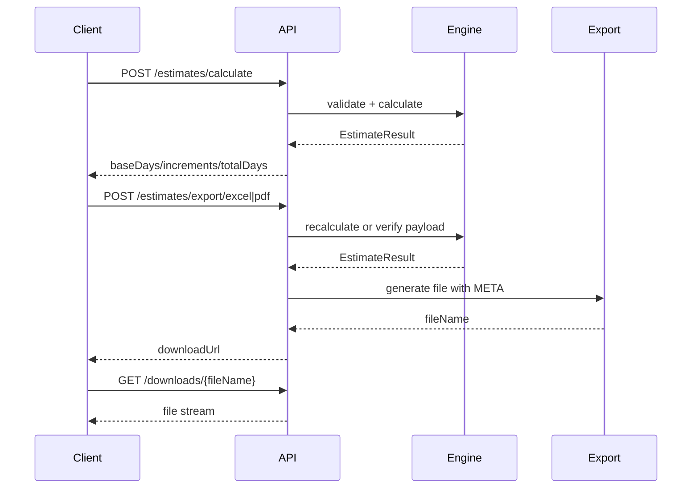

# 工作量评估系统 - API 接口设计 V2（计算导出型）

## 1. 约定

- Base URL：`/api/v1`
- 数据格式：`application/json`
- 鉴权方式：可选（内网可关闭鉴权）
- 时间格式：ISO-8601（UTC）
- 分页参数：
  - `page`（默认 1）
  - `pageSize`（默认 20，最大 200）

### 1.1 API 分层图（Mermaid）

```mermaid
flowchart LR
    C[Client/Web] --> T1[/templates]
    C --> T2[/rule-sets/active]
    C --> T3[/estimates/calculate]
    C --> T4[/estimates/export/*]
    C --> T5[/downloads/{fileName}]
    T1 --> S[API Service]
    T2 --> S
    T3 --> S
    T4 --> S
    T5 --> S
    S --> E[Estimate Engine]
    S --> X[Export Generator]
    S --> F[(Config Files + Export Files)]
```

## 2. 通用响应结构

### 2.1 成功
```json
{
  "code": 0,
  "message": "ok",
  "data": {}
}
```

### 2.2 失败
```json
{
  "code": 40001,
  "message": "参数错误",
  "details": [
    {
      "field": "templateId",
      "reason": "required"
    }
  ],
  "requestId": "9f53f5c2b3c04b7b"
}
```

## 3. 认证（可选）

## 3.1 登录
- `POST /auth/login`

请求：
```json
{
  "username": "operator01",
  "password": "******"
}
```

响应：
```json
{
  "code": 0,
  "message": "ok",
  "data": {
    "accessToken": "jwt-token",
    "refreshToken": "refresh-token",
    "expiresIn": 7200,
    "user": {
      "id": "uuid",
      "username": "operator01",
      "displayName": "张三",
      "roles": ["operator"]
    }
  }
}
```

## 3.2 刷新令牌
- `POST /auth/refresh`

## 3.3 当前用户信息（可选）
- `GET /users/me`

## 4. 模板接口

## 4.1 模板列表
- `GET /templates`
- 查询参数：
  - `templateType`：`module|suite|online_package`
  - `status`：`draft|active|archived`
  - `keyword`

## 4.2 模板详情（含分组与条目）
- `GET /templates/{templateId}`

响应 data 关键字段：
- `template`
- `groups[]`
- `items[]`

## 4.3 刷新模板缓存
- `POST /templates/reload`

## 5. 规则接口

## 5.1 当前生效规则
- `GET /rule-sets/active?templateId={id}`

## 5.2 刷新规则缓存
- `POST /rule-sets/reload`

## 5.3 规则元信息（可选）
- `GET /rule-sets/meta?templateId={id}`
- 返回：`grouping`、`itemRule`、`baseRule`、`orgIncrementRule`、`pipeline`

## 6. 估算接口（核心）

### 6.0 计算与导出时序图（Mermaid）



## 6.1 仅计算（不落库）
- `POST /estimates/calculate`

请求示例：
```json
{
  "templateId": "uuid",
  "ruleSetId": "uuid",
  "userCount": 120,
  "difficultyFactor": 0.2,
  "orgCount": 3,
  "orgSimilarityFactor": 0.6,
  "items": [
    {
      "templateItemId": "uuid",
      "included": true
    },
    {
      "templateItemId": "uuid",
      "included": false
    }
  ]
}
```

响应示例：
```json
{
  "code": 0,
  "message": "ok",
  "data": {
    "templateId": "uuid",
    "ruleSetId": "uuid",
    "templateVersion": "2026.03",
    "ruleVersion": "2026.03.1",
    "pipelineVersion": "2026.03.1",
    "baseDays": 820,
    "userIncrementDays": 82,
    "difficultyIncrementDays": 180.4,
    "orgIncrementDays": 180.4,
    "totalDays": 1262.8,
    "calculationBreakdown": {},
    "groupSubtotals": [
      {
        "groupId": "uuid",
        "groupName": "财务云",
        "subtotalDays": 210
      }
    ],
    "itemResults": [
      {
        "templateItemId": "uuid",
        "included": true,
        "standardDays": 8,
        "itemSubtotalDays": 8
      }
    ]
  }
}
```

## 6.2 一次性计算并导出（推荐）
- `POST /estimates/calculate-and-export`

请求：
```json
{
  "exportType": "excel",
  "templateId": "uuid",
  "ruleSetId": "uuid",
  "userCount": 120,
  "difficultyFactor": 0.2,
  "orgCount": 3,
  "orgSimilarityFactor": 0.6,
  "items": [
    { "templateItemId": "uuid", "included": true }
  ]
}
```

响应：
```json
{
  "code": 0,
  "message": "ok",
  "data": {
    "totalDays": 1262.8,
    "downloadUrl": "/downloads/estimate-20260324-001.xlsx",
    "expireAt": "2026-03-31T00:00:00Z"
  }
}
```

## 7. 导出接口

## 7.1 导出 Excel
- `POST /estimates/export/excel`

## 7.2 导出 PDF
- `POST /estimates/export/pdf`

## 7.3 下载文件
- `GET /downloads/{fileName}`

## 7.4 查询导出历史（可选）
- `GET /exports/history?page=1&pageSize=20`

## 8. 字典接口（可选）

## 8.1 字典项查询
- `GET /dictionaries/{dictCode}`

示例：
- `template_type`
- `rule_type`

## 9. 错误码定义（V1）

- `0`：成功
- `40001`：参数错误
- `40003`：规则校验失败
- `40101`：未登录或 token 无效
- `40301`：无权限访问
- `40401`：资源不存在
- `42201`：计算请求数据不完整
- `50001`：系统内部错误

## 10. 幂等与并发建议

- 关键导出接口支持 `Idempotency-Key`，避免重复导出。
- 同一 `Idempotency-Key` + 相同请求体：返回相同 `downloadUrl` 与同一 `requestId`（幂等重放）。
- 同一 `Idempotency-Key` + 不同请求体：返回 `40001`，`details.reason=payload_conflict`。
- 导出支持同步返回（小文件）和异步返回（大文件）两种模式。

## 11. Agent 兼容要求（V1）

- 请求需显式传入 `templateId` 和 `ruleSetId/templateVersion`，避免口径漂移。
- 计算返回应包含三层数据：
  - `itemResults`
  - `groupSubtotals`
  - `totalDays`
- 新增/约定解释性字段 `calculationBreakdown`，用于 Agent 生成可解释报告。
- 所有错误响应必须包含 `requestId` 便于排障。
- 建议按 `clientId` 或 token 做基础限流。

### 11.1 `calculationBreakdown` 建议结构

```json
{
  "calculationBreakdown": {
    "userCountTier": {
      "hitRange": "91-130",
      "factor": 0.15,
      "incrementDays": 120
    },
    "difficulty": {
      "factor": 0.2,
      "incrementDays": 160
    },
    "organization": {
      "orgCount": 3,
      "similarityFactor": 0.6,
      "incrementDays": 144
    }
  }
}
```

## 12. 评估流程与校验（评审已确认）

### 12.1 模板与版本
- 请求须包含 `templateId` 与模板/规则版本标识（如 `ruleSetId` 或 `templateVersion`），服务端不隐式升级版本。

### 12.2 计算请求必填与约束
- `userCount`：整数，`>= 0`
- `orgCount`：整数，`>= 0`
- `difficultyFactor`、`orgSimilarityFactor`：须与当前 `rule-sets/active` 中枚举一致，否则 `40003`
- `items[]`：当前实现要求**完整覆盖模板条目**；缺失条目返回 `42201`（`missing_item_ids:*`）。
- `items[]`：若包含模板中不存在的 `templateItemId`，返回 `40001`（`unknown_item_ids:*`）。
- 规则执行由 `pipeline` 决定，不允许前端自行指定执行顺序

### 12.3 权威结果
- `POST /estimates/calculate` 的响应为权威结果；前端本地预估仅作体验，导出与 Agent 消费均以服务端为准。

### 12.4 导出 META
- Excel/PDF 导出须含 `META` 区域或页：完整输入、`templateVersion`/`ruleSetId`、导出时间、`requestId`。

### 12.5 导出文件 TTL
- 默认保留 7 天，由环境变量 `EXPORT_FILE_TTL_DAYS` 配置，到期清理。

## 13. 规则化抽象约束（评审已确认）

- 系统必须支持以下规则可配置并可版本化：
  - `grouping`
  - `itemRule`
  - `baseRule`
  - `orgIncrementRule`
- 口径变化通过发布新规则版本完成，不通过修改业务代码完成。
- API 响应需回传 `ruleVersion` 与 `pipelineVersion`，用于追溯。

## 14. 需求评审 6：接口与技术层（评审已确认）

以下与 §1~§13 及 `03_技术设计/安全与权限/权限模型设计-V2.md` 对齐，作为编码前 API 合同基线。

### 14.1 REST 与通用约定
- Base URL：`/api/v1`；请求/响应体：`application/json`；时间：ISO-8601（UTC）；列表分页：`page` / `pageSize`（§1）。

### 14.2 响应与可观测性
- 成功：`code`、`message`、`data`；`calculate` 与导出成功响应建议/当前实现也返回 `requestId` 便于端到端追踪。
- 失败：`code`、`message`、可选 `details[]`、**`requestId`**（§2.2）；与 Agent 排障要求一致（§11）。

### 14.3 核心端点分组
- **模板**：`GET /templates`、`GET /templates/{templateId}`、`POST /templates/reload`（§4）。
- **规则**：`GET /rule-sets/active`、`POST /rule-sets/reload`、可选 `GET /rule-sets/meta`（§5）。
- **估算**：`POST /estimates/calculate`、`POST /estimates/calculate-and-export`（§6）。
- **导出与下载**：`POST /estimates/export/excel|pdf`、`GET /downloads/{fileName}`；可选 `GET /exports/history`（§7）。

### 14.4 版本、元数据与追溯字段
- 请求须显式携带 `templateId` 与规则版本标识（`ruleSetId` 或与模板绑定的版本字段），服务端不隐式升级（§12.1）。
- **`GET /rule-sets/meta`**（可选）：供管理端/调试展示 `grouping`、`itemRule`、`baseRule`、`orgIncrementRule`、`pipeline`（§5.3）。
- **计算响应**须包含 `ruleVersion`、`pipelineVersion`；建议同时返回 `templateId`、`ruleSetId`、`templateVersion`（若模板侧有版本号），便于对账与导出 META（§13、§12.4）。
- 解释性字段 **`calculationBreakdown`**：与 §11.1 结构一致，供 Web 展示与 Agent 生成说明。

### 14.5 幂等、导出模式与 TTL
- 导出类接口支持请求头 **`Idempotency-Key`**；支持同步返回与小文件、异步与大文件两种模式（§10）。
- 幂等键建议由前端在“点击导出”时生成并复用到重试请求；不要跨不同业务参数复用同一键。
- 下载文件默认 TTL 7 天，环境变量 `EXPORT_FILE_TTL_DAYS` 可配（§12.5）。

### 14.6 OpenAPI 与 Agent 工具描述
- 建议以 **OpenAPI 3.x** 作为对外契约的单一事实来源（路径、模型、错误码），Agent 工具（function calling）的参数与说明从同一 OpenAPI 派生或与之同步，避免「文档一套、实现一套」。

### 14.7 鉴权与权限矩阵对齐
- 启用鉴权时，JWT 内 `roles` 仅 **`admin` | `operator`**，与权限模型 V2 一致；`template.reload`、`rule_set.reload` 等维护类接口仅 `admin`（见权限矩阵）。
- 内网可关闭鉴权时，维护类接口仍建议通过部署配置限制来源网段或独立管理端口。
