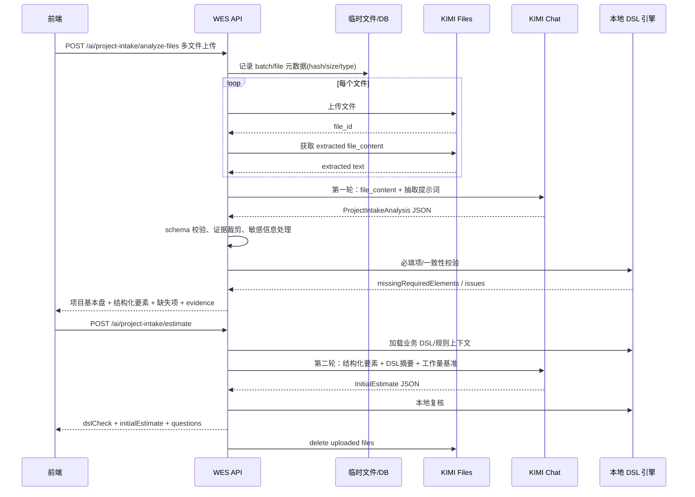

# KIMI Files 两段式解析 + 工作量评估初版设计

> 版本：V0.1  
> 日期：2026-05-11  
> 适用范围：需求导入、文件解析、Kimi 评估预览、DSL 校验与初步工作量评估

## 1. 结论

该方案可行，并且比当前“Excel 文本化后一轮抽取 + 评估”的方式更适合真实售前材料。

原因有三点：

1. 用户上传材料格式高度不统一，后端长期维护 Word、PDF、Excel、图片化 PDF、混合附件的本地解析器，成本高且边界复杂。
2. KIMI Files 的定位正好覆盖“先上传文件、取回抽取后的 file_content、再放进 chat messages 做问答/结构化分析”的模式。
3. 当前系统已经具备 `parse-basic-info`、`kimi-assessment/preview`、`requirement_packs`、`extraction_results`、`evidences`、`dsl` 等基础模块，适合演进为“两段式流水线”，不需要推翻现有评估链路。

推荐主路径：

```text
用户上传多文件
  -> 后端生成 uploadBatch
  -> KIMI Files 逐文件上传并获取 extracted file_content
  -> 第一轮模型：项目画像 + 关键要素结构化 + 缺失必填项 + 证据
  -> 本地 schema/证据/敏感信息校验
  -> 第二轮模型：结合结构化要素 + DSL/规则上下文做初步评估
  -> 本地 DSL 引擎复核 + 结果入库/预览
```

当前 Excel 规则解析保留为 fallback 与校验器。

## 2. 官方能力依据

根据 KIMI / Moonshot 官方 Files 与 File-Based Q&A 文档，集成模式不是把 `file_id` 直接塞给 chat，而是：

1. 使用 Files API 上传文件。
2. 获取文件抽取内容。
3. 将抽取后的 `file_content` 作为 message content 的一部分传给 Chat Completions。
4. 文件不再需要时调用删除接口清理远端文件。

工程含义：

- 后端必须负责“上传、抽取、拼装上下文、删除”四件事。
- `file_id` 只作为远端文件生命周期管理与追踪字段，不作为第二轮评估输入。
- 入库建议只保存 hash、文件名、大小、MIME、摘要、结构化结果和短证据片段，不保存完整原文。

参考：

- [Kimi API Platform: Files](https://platform.kimi.ai/docs/api/files)
- [Kimi API Platform: Upload File](https://platform.kimi.ai/docs/api/files-upload)
- [Kimi API Platform: Get File Content](https://platform.kimi.ai/docs/api/files-content)
- [Kimi API Platform: Delete File](https://platform.kimi.ai/docs/api/files-delete)

## 3. 现状评估

### 3.1 已有能力

后端已有：

- `apps/api/src/routes/ai.routes.ts`
  - `POST /api/v1/ai/parse-basic-info`
  - `POST /api/v1/ai/parse-basic-info/stream`
  - `POST /api/v1/ai/kimi-assessment/preview`
- `apps/api/src/services/ai/extractor.service.ts`
  - 当前仅面向 Excel workbook，先本地规则读表，再调用 Kimi 抽取结构化需求。
- `apps/api/src/services/ai/assessment.service.ts`
  - 当前根据 `requirementSnapshot` 生成 Kimi 评估草稿。
- `apps/api/src/services/ai-assessment.ts`
  - 已有 fallback 评估、模块对齐、SKU reason 归一化、开发人天合并。
- `apps/api/src/dsl/*`
  - 已有最小 DSL 执行框架，但 RuleContext 当前主要围绕 evidences。
- `apps/api/src/db/schema/extraction_results.ts`
  - 已有抽取结果头记录。
- `apps/api/src/db/schema/requirement_packs.ts`
  - 已有结构化需求包雏形。

### 3.2 当前不足

1. 文件入口仍以单 Excel 为中心：`multer.single("file")`、10MB 限制、`XLSX.read` 强绑定。
2. 当前 AI 抽取目标是需求页表单结构，不是“多文件项目画像”。
3. 当前证据链粒度偏向字段 evidence，缺少“源文件 + 页/表/片段 + 模型置信度”的统一文件证据结构。
4. 第二轮评估目前由 `requirementSnapshot` 直接驱动，DSL 规则不是一等输入。
5. 日志/返回中仍可能携带 `rawContent`，多文件方案下需要更严格控制原文落库和输出。

## 4. 目标设计

### 4.1 设计原则

- 两段职责拆分：第一轮只负责读材料与归纳证据，第二轮只负责规则判断与估算。
- 模型输出必须结构化，但不完全信任模型：用本地 schema、枚举、DSL、数值边界做校验。
- 证据可追溯：每个关键字段尽量有来源文件与短引用。
- 本地规则不废弃：Excel 规则解析继续作为 fallback、补全器和一致性校验器。
- 不落完整原文：原始文件与 KIMI 抽取全文只在请求生命周期或短 TTL 临时存储中存在。

### 4.2 总体架构



## 5. 新增核心数据结构

### 5.1 ProjectIntakeAnalysis

第一轮输出。

```ts
type ProjectIntakeAnalysis = {
  analysisId: string;
  uploadBatchId: string;
  projectBrief: {
    customerName: string;
    projectName: string;
    industry: string;
    businessContext: string;
    currentSystems: string;
    targetSystems: string;
    scopeSummary: string;
    expectedGoLive: string;
  };
  keyElements: {
    businessNeeds: KeyElement[];
    modules: KeyElement[];
    organizations: KeyElement[];
    integrations: KeyElement[];
    customDevItems: KeyElement[];
    dataMigration: KeyElement[];
    reports: KeyElement[];
    risks: KeyElement[];
    constraints: KeyElement[];
  };
  missingRequiredElements: MissingElement[];
  evidence: FileEvidence[];
  confidence: {
    overall: number;
    byField: Record<string, number>;
  };
  normalizedRequirementSnapshot: KimiAssessmentSnapshot;
};
```

### 5.2 KeyElement

```ts
type KeyElement = {
  id: string;
  name: string;
  description: string;
  category: string;
  priority?: "high" | "medium" | "low";
  workloadSignal?: "implementation" | "custom_dev" | "integration" | "migration" | "report" | "risk";
  evidenceIds: string[];
};
```

### 5.3 MissingElement

```ts
type MissingElement = {
  field: string;
  fieldPath: string;
  reason: string;
  severity: "error" | "warning" | "info";
  suggestedQuestion: string;
};
```

### 5.4 FileEvidence

```ts
type FileEvidence = {
  evidenceId: string;
  fieldPath: string;
  sourceFileName: string;
  sourceFileHash: string;
  sourceType: "xlsx" | "docx" | "pdf" | "txt" | "image" | "unknown";
  locator?: {
    sheetName?: string;
    pageNumber?: number;
    sectionName?: string;
    rowIndex?: number;
  };
  quote: string;
  confidence: number;
};
```

约束：

- `quote` 最长建议 200 字。
- 不保存完整 `file_content`。
- `sourceFileHash` 使用 SHA-256。
- 对身份证、手机号、邮箱、合同金额等敏感字段做日志脱敏。

### 5.5 InitialEstimate

第二轮输出。

```ts
type InitialEstimateResult = {
  dslCheck: {
    passed: boolean;
    issues: Array<{
      ruleId: string;
      severity: "error" | "warning" | "info";
      fieldPath: string;
      message: string;
      suggestion?: string;
    }>;
  };
  initialEstimate: {
    quoteMode: string;
    productLines: string[];
    moduleItems: Array<{
      cloudProduct?: string;
      skuName?: string;
      moduleName: string;
      standardDays: number;
      suggestedDays: number;
      reason: string;
      evidenceIds: string[];
    }>;
    totalDays: number;
    assumptions: string[];
    risks: string[];
  };
  questions: MissingElement[];
};
```

## 6. API 设计

### 6.1 多文件解析

`POST /api/v1/ai/project-intake/analyze-files`

请求：

- `multipart/form-data`
- 字段：`files[]`
- 可选：`projectHint`、`customerNameHint`、`analysisMode=fast|balanced|strict`

限制建议：

- 单文件默认 30MB，可配置。
- 单次最多 10 个文件，可配置。
- 允许类型：`xlsx/xls/csv/docx/pdf/txt/md/png/jpg`。
- 图片类文件第一阶段先允许上传给 KIMI Files，但前端标记“识别质量依赖文件清晰度”。

返回：

```json
{
  "code": 0,
  "data": {
    "analysisId": "uuid",
    "uploadBatchId": "uuid",
    "projectBrief": {},
    "keyElements": {},
    "missingRequiredElements": [],
    "evidence": [],
    "confidence": {},
    "normalizedRequirementSnapshot": {},
    "meta": {
      "model": "kimi-k2.5",
      "mode": "model",
      "fileCount": 3,
      "elapsedMs": 0,
      "fallbacks": []
    }
  },
  "requestId": "uuid"
}
```

### 6.2 SSE 解析进度

`POST /api/v1/ai/project-intake/analyze-files/stream`

事件建议：

- `upload_received`
- `file_uploading`
- `file_uploaded`
- `file_extracting`
- `file_extracted`
- `model_start`
- `model_delta`
- `schema_validating`
- `dsl_checking`
- `complete`
- `fallback`
- `error`

前端可以复用当前 `parse-basic-info/stream` 的进度弹窗形态。

### 6.3 初步工作量评估

`POST /api/v1/ai/project-intake/estimate`

请求：

```json
{
  "analysisId": "uuid",
  "projectIntakeAnalysis": {},
  "ruleContext": {
    "promptProfile": "assessment_default_v2",
    "ruleSetId": "assessment-rules-v1"
  }
}
```

返回：

```json
{
  "code": 0,
  "data": {
    "dslCheck": {
      "passed": false,
      "issues": []
    },
    "initialEstimate": {
      "quoteMode": "",
      "productLines": [],
      "moduleItems": [],
      "totalDays": 0,
      "assumptions": [],
      "risks": []
    },
    "questions": [],
    "meta": {
      "model": "kimi-k2.5",
      "mode": "model",
      "elapsedMs": 0
    }
  },
  "requestId": "uuid"
}
```

### 6.4 兼容现有接口

短期保持：

- `POST /api/v1/ai/parse-basic-info`
- `POST /api/v1/ai/parse-basic-info/stream`
- `POST /api/v1/ai/kimi-assessment/preview`

新增链路稳定后：

- “Kimi解析文件”入口优先走 `project-intake/analyze-files`。
- 若只上传单个 Excel 且新链路失败，可 fallback 到 `parse-basic-info`。
- `kimi-assessment/preview` 可继续作为第二轮底层实现之一，但入参由 `normalizedRequirementSnapshot` 生成。

## 7. 第一轮提示词设计

System：

```text
你是企业软件项目售前评估资料分析助手。
你的任务是从多个格式不统一的项目材料中归纳项目基本盘、关键工作量要素、缺失必填信息与证据。
只输出合法 JSON，不输出 Markdown。
不得编造材料中不存在的信息；缺失字段填空字符串或空数组。
所有关键结论必须尽量关联 evidence。
引用片段必须短，不能包含大段原文。
```

User 内容结构：

```text
请基于以下文件抽取内容生成 ProjectIntakeAnalysis。

输出 schema: ...

必填检查口径:
- 客户名称
- 项目名称
- 行业
- 实施范围
- 组织数量/试点组织
- 产品线/模块范围
- 用户规模
- 是否有集成
- 是否有定制开发
- 是否有数据迁移
- 上线时间或里程碑

文件:
<file name="A.docx" sha256="...">
... file_content ...
</file>
<file name="B.xlsx" sha256="...">
... file_content ...
</file>
```

后处理：

- JSON parse 失败：重试一次，提示“修复为合法 JSON”。
- 字段缺失：本地补 `missingRequiredElements`。
- evidence 为空但字段有值：降置信度，追加 warning。
- 数组过长：按 workloadSignal 与 evidence 去重裁剪。

## 8. 第二轮提示词设计

System：

```text
你是资深项目经理 + 实施顾问 + 工作量评估专家。
你只根据第一轮结构化要素、证据摘要和 DSL 规则上下文进行初步工作量评估。
不要重新从原始混乱文件中找信息。
只输出合法 JSON。
当必填项缺失时，不要强行精确估算；应返回问题、假设和风险。
```

User 内容结构：

```text
第一轮结构化要素:
{ProjectIntakeAnalysis}

DSL/规则上下文:
{
  "requiredFields": [],
  "moduleDependencies": [],
  "industryRules": [],
  "skuMapping": [],
  "workloadBaseline": []
}

请输出 InitialEstimateResult。
```

第二轮本地复核：

- `suggestedDays >= 0`
- `totalDays = sum(moduleItems.suggestedDays)`
- 缺少 error 级必填项时，`dslCheck.passed=false`
- 模型返回的 DSL issues 与本地 DSL 引擎结果合并，本地结果优先
- 超出标准人天阈值的条目必须有 `reason` 和 `evidenceIds`

## 9. 后端实现方案

### 9.1 新增 KIMI Files Client

建议新增：

- `apps/api/src/ai/provider/kimi-files-client.ts`

接口：

```ts
type UploadedKimiFile = {
  fileId: string;
  fileName: string;
  bytes: number;
  sha256: string;
};

interface KimiFilesClient {
  upload(file: Express.Multer.File): Promise<UploadedKimiFile>;
  getContent(fileId: string): Promise<string>;
  delete(fileId: string): Promise<void>;
}
```

注意：

- baseUrl 复用 `config.kimi.apiBaseUrl`。
- 官方文档当前示例使用 `https://api.moonshot.ai/v1`；现有系统默认值为 `https://api.moonshot.cn/v1`，实现时应通过环境变量保持可配置，并在联调时确认 Files API 在当前账号/域名下可用。
- apiKey 复用 `resolveActiveRequirementKimiApiKey()`。
- 上传失败按文件记录 fallback，不必让整个 batch 立即失败，除非全部失败。
- `delete` 在 finally 中执行；失败只记 warning，不影响用户响应。

### 9.2 新增服务

建议新增：

- `apps/api/src/services/ai/project-intake.service.ts`

职责：

- 接收多文件。
- 生成 hash 与元数据。
- 调用 KIMI Files 抽取。
- 组装第一轮 prompt。
- 标准化 ProjectIntakeAnalysis。
- 调 DSL 必填校验。
- 调第二轮评估。
- 清理远端文件。

### 9.3 新增路由

在 `apps/api/src/routes/ai.routes.ts` 增加：

```ts
router.post(
  "/project-intake/analyze-files",
  upload.array("files", 10),
  requireCapability("extractor:trigger"),
  AiModule.analyzeProjectFiles,
);

router.post(
  "/project-intake/analyze-files/stream",
  upload.array("files", 10),
  requireCapability("extractor:trigger"),
  AiModule.analyzeProjectFilesStream,
);

router.post(
  "/project-intake/estimate",
  requireCapability("assessment:create"),
  AiModule.estimateProjectIntake,
);
```

### 9.4 配置项

建议扩展 `config.kimi`：

```ts
kimi: {
  apiKey: string;
  model: string;
  apiBaseUrl: string;
  files: {
    enabled: boolean;
    maxFiles: number;
    maxFileSize: number;
    deleteRemoteAfterUse: boolean;
    extractedContentMaxCharsPerFile: number;
    extractedContentMaxCharsTotal: number;
  };
}
```

`.env.example` 增加：

```text
KIMI_FILES_ENABLED=true
KIMI_FILES_MAX_FILES=10
KIMI_FILES_MAX_FILE_SIZE_MB=30
KIMI_FILES_DELETE_REMOTE_AFTER_USE=true
KIMI_FILES_MAX_CHARS_PER_FILE=60000
KIMI_FILES_MAX_CHARS_TOTAL=180000
```

## 10. 数据落库建议

第一阶段可以尽量轻量：

1. 复用 `extraction_results` 记录一次解析任务。
2. 复用/扩展 `evidences` 保存短证据。
3. 复用 `requirement_packs` 保存结构化要素：
   - `structuredRequirements = keyElements`
   - `industry = projectBrief.industry`
   - `modules = keyElements.modules`
   - `constraints = keyElements.constraints`
4. 不落完整 `file_content`。

若需要更完整审计，再新增：

- `upload_batches`
- `uploaded_file_refs`
- `project_intake_analyses`

最小新增表：

```ts
uploaded_file_refs {
  fileRefId uuid primary key
  uploadBatchId uuid
  originalName text
  mimeType text
  size integer
  sha256 text
  remoteFileId text nullable
  remoteDeletedAt timestamp nullable
  extractStatus text
  extractSummary text
  createdAt timestamp
}
```

## 11. DSL 对接

当前 `RuleContext` 主要接受 `evidences`。建议扩展为：

```ts
interface ProjectDslContext extends RuleContext {
  projectBrief: ProjectIntakeAnalysis["projectBrief"];
  keyElements: ProjectIntakeAnalysis["keyElements"];
  normalizedRequirementSnapshot: KimiAssessmentSnapshot;
}
```

首批规则：

- `required-project-identity-v1`
  - 客户名称、项目名称、行业。
- `required-scope-v1`
  - 实施范围、组织数量、试点/推广范围。
- `required-module-boundary-v1`
  - 产品线、模块、用户规模。
- `integration-risk-v1`
  - 有接口/集成但缺少系统名、接口数量、联调责任。
- `custom-dev-risk-v1`
  - 有二开但缺少功能描述、复杂度、人天依据。
- `migration-risk-v1`
  - 有迁移但缺少对象、数据量、清洗责任。
- `timeline-risk-v1`
  - 有上线日期但范围/组织/定制项不完整。

第二轮模型的 `dslCheck` 只能作为说明，本地 DSL 引擎结果是权威结果。

## 12. 安全与合规

必须做：

- 日志不打印完整 `file_content`、模型原始 `rawContent`、用户上传原文。
- 文件 hash 替代文件内容做链路追踪。
- evidence quote 限长。
- 远端文件 finally 删除。
- 删除失败进入 warning，并提供后台清理任务重试。
- API Key 仍走系统配置或环境变量，不返回前端。
- 前端仅展示短引用，不提供“查看完整抽取原文”。

建议做：

- 对手机号、邮箱、身份证、银行卡等做脱敏。
- `analysisId` 与用户/团队权限绑定。
- 临时本地文件 TTL 30 分钟以内；内存模式优先。
- 大文件/多文件增加总 token 预算，超限时先做文件级摘要再汇总。

## 13. 降级策略

| 场景 | 降级 |
| --- | --- |
| KIMI Files 不可用 | 单 Excel 走现有 `parse-basic-info`；其他格式返回“解析服务不可用，请补充结构化信息” |
| 单个文件上传失败 | 记录该文件失败，继续解析其他文件 |
| 全部文件上传失败 | 返回错误，不进入模型评估 |
| file_content 超长 | 文件级摘要压缩，再进入第一轮汇总 |
| 第一轮 JSON 失败 | 让模型修复 JSON；仍失败则返回 partial + 人工补问 |
| 第二轮模型失败 | 使用现有 `estimateFallbackAssessmentDraft` 生成保守草稿 |
| DSL error 必填缺失 | 不阻断预览，但标记 `passed=false`，前端展示补问 |

## 14. 前端改造

需求导入页建议把当前“智能解析回填”升级为“资料包解析”：

- 支持拖拽多文件。
- 文件列表展示：文件名、大小、状态、解析质量。
- 第一轮完成后展示：
  - 项目基本盘
  - 关键要素分组
  - 缺失必填要素
  - 证据短引用
- 用户可编辑结构化要素。
- 点击“发起初步评估”进入第二轮。
- 第二轮完成后复用当前 `Kimi 评估预览` 弹窗。

## 15. 分阶段实施

### P0：后端最小闭环

- 新增 KIMI Files client。
- 新增 `analyze-files` 非流式接口。
- 支持多文件上传、抽取、第一轮结构化输出。
- 不落完整原文，只返回结构化结果。
- 单元测试覆盖 JSON normalize、缺失项计算、证据裁剪。

### P1：第二轮评估闭环

- 新增 `project-intake/estimate`。
- 将 `ProjectIntakeAnalysis` 转为 `KimiAssessmentSnapshot`。
- 复用 `generateAssessmentDraftByKimi` 与本地 fallback。
- 合并本地 DSL 结果。
- 前端接入新入口。

### P2：流式进度与持久化

- 新增 SSE 进度。
- 复用/扩展 `extraction_results`、`evidences`、`requirement_packs`。
- 增加远端文件删除重试任务。

### P3：质量增强

- 文件级摘要压缩。
- 历史项目相似案例召回。
- 行业规则/模块依赖/基准人天配置化。
- 解析质量评分与人工修订闭环。

## 16. 验收标准

P0 验收：

- 上传 1 个 Excel、1 个 Word、1 个 PDF，能返回统一 `ProjectIntakeAnalysis`。
- 缺少实施范围时能稳定返回 `missingRequiredElements`。
- evidence 包含来源文件名、hash、短引用。
- 日志中不出现完整文件原文。
- KIMI Files 远端文件在流程结束后被删除或记录删除失败 warning。

P1 验收：

- 第一轮结果可触发第二轮初步评估。
- 第二轮返回 moduleItems、totalDays、assumptions、risks。
- DSL error 必填缺失时，`dslCheck.passed=false`。
- 现有单 Excel 流程仍可用。

## 17. 主要风险

1. 官方 Files 抽取质量对扫描件、图片 PDF、复杂表格可能不稳定，需要 evidence 置信度和人工校正。
2. 多文件总内容过长会推高 token 成本，需要摘要压缩与字符上限。
3. 模型可能把“范围枚举”误判为“工作量增量”，第二轮仍需沿用当前 SKU reason 归一化和本地 DSL 复核。
4. 文件包含客户敏感资料，日志与存储策略必须先于功能上线完成。
5. 如果业务 DSL 仍停留在代码规则，模型只能理解摘要规则；后续应把规则上下文整理成机器与模型都可读的规则包。

## 18. 建议优先级

建议先做 P0 + P1，不急着一开始做完整持久化。

最小可交付是：

```text
多文件上传解析
  -> 返回项目画像/关键要素/缺失项/证据
  -> 用户确认或编辑
  -> 发起初步评估
  -> 返回当前 Kimi 评估预览兼容的 assessmentDraft
```

这样可以最快验证“格式不统一材料是否能稳定转为评估输入”，同时保留现有 Excel 解析链路作为兜底。
