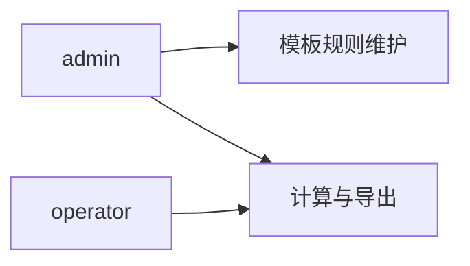
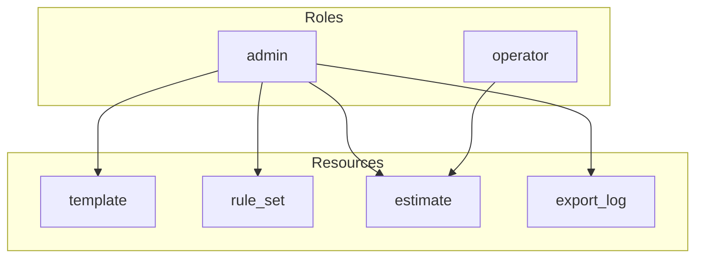

# 工作量评估系统 - 权限模型设计 V2（轻量）

## 1. 目标

- 满足最小权限原则，避免模板/规则被误改。
- 适配“计算 + 导出”场景，不引入项目管理权限复杂度。
- 保留必要的访问控制和最小操作留痕（可选）。

## 2. 角色定义（最小 RBAC）

### 2.0 角色关系图（Mermaid）

## 2.1 `admin`（管理员）
- 模板与规则的维护、刷新
- 估算计算与导出
- 下载导出文件
- 可选：查看导出历史/日志

## 2.2 `operator`（操作员）
- 使用模板进行估算计算
- 导出 Excel/PDF
- 下载导出文件
- 不可修改模板与规则

## 3. 资源与动作

- `template`：`read`, `reload`
- `rule_set`：`read`, `reload`
- `estimate`：`calculate`, `export`, `download`
- `export_log`（可选）：`read`

## 4. 权限矩阵

| 资源/动作 | admin | operator |
|---|---|---|
| template.read | Y | Y |
| template.reload | Y | N |
| rule_set.read | Y | Y |
| rule_set.reload | Y | N |
| estimate.calculate | Y | Y |
| estimate.export | Y | Y |
| estimate.download | Y | Y |
| export_log.read（可选） | Y | N |

### 4.1 权限矩阵图（Mermaid）

## 5. 数据访问范围

- `admin`：全量访问（含模板规则维护）。
- `operator`：仅估算与导出相关接口。
- 由于不做项目持久化，默认不存在“项目级数据隔离”。

## 6. 鉴权方案

- 内网部署可关闭鉴权，仅保留管理入口 IP 白名单。
- 若开启鉴权，建议 JWT（短时 token）即可，不强制 refresh token。
- 接口按资源动作做中间件校验。

## 7. 最小留痕策略（可选）

建议记录以下事件：
- 模板刷新
- 规则刷新
- 导出动作（时间、导出类型、文件名、操作者）

记录字段建议：
- `operator`
- `action`
- `templateId`
- `exportType`
- `fileName`
- `createdAt`

## 8. 安全基线

- 密码仅存哈希（`bcrypt` 或 `argon2`）。
- Token 密钥按环境隔离，建议定期轮换。
- 模板/规则刷新接口仅 `admin` 可用。
- 导出文件 URL 建议短时有效签名。
