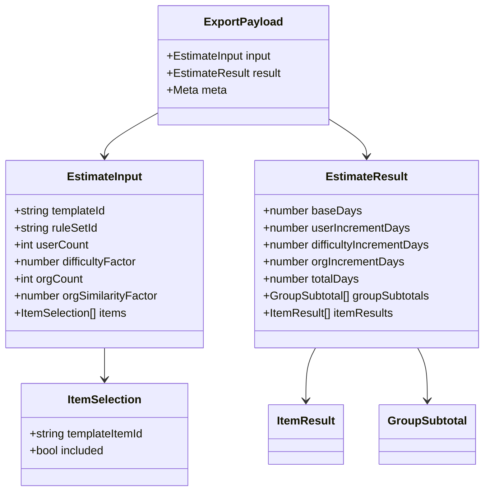

# 工作量评估系统 - 数据模型设计 V2（精简存储）

## 1. 设计目标

- 坚持轻量化：系统以计算与导出为主，不做复杂业务持久化。
- 模板与规则可文件化管理，避免引入重型数据库设计。
- 每次评估完成后通过导出文档留存输入与结果。

## 2. 数据存储原则

- 默认不落业务库（无 `estimate_project` / `snapshot` / `audit` 主表）。
- 模板与规则以 JSON 文件形式存放：
  - `config/templates/*.json`
  - `config/rules/*.json`
- 导出文件落盘（或对象存储）并定期清理。
- 可选最小日志文件记录导出行为（CSV/JSONL）。

## 3. 运行时数据对象（非持久化）

- `EstimateInput`：前端提交的估算输入
- `EstimateResult`：后端计算输出
- `ExportPayload`：导出所需输入 + 输出 + 元数据

### 3.1 运行时模型关系图（Mermaid）



## 4. 文件模型定义

## 4.1 模板文件 `template.json`

### 4.0 配置文件关系图（Mermaid）

```mermaid
flowchart TD
    T[template.json] --> G[groups[]]
    T --> I[items[]]
    I -->|groupId| G
    R[rules.json] --> U[userCountTiers]
    R --> D[difficultyFactors]
    R --> O[orgSimilarityFactors]
    T --> P[EstimateInput]
    R --> P
    P --> Q[EstimateResult]
    Q --> EP[ExportPayload]
```

```json
{
  "meta": {
    "code": "module_quote",
    "name": "模块报价",
    "version": "R202602-V1.0",
    "type": "module"
  },
  "groups": [
    {
      "id": "finance",
      "name": "财务云",
      "parentId": null,
      "sortOrder": 10
    }
  ],
  "items": [
    {
      "id": "GL-001",
      "groupId": "finance",
      "name": "总账",
      "standardDays": 2,
      "defaultIncluded": true,
      "evaluationNote": "如需多账簿另行评估",
      "sortOrder": 100
    }
  ]
}
```

## 4.2 规则文件 `rules.json`

```json
{
  "meta": {
    "version": "R202602-V1.0",
    "engineVersion": "1.0.0"
  },
  "grouping": {
    "levels": ["cloudProduct", "sku", "group"],
    "subtotalBy": "group"
  },
  "itemRule": {
    "expression": "included ? standardDays : 0",
    "includedValues": [true, "√", 1]
  },
  "baseRule": {
    "aggregate": "sum",
    "source": "itemSubtotal"
  },
  "userCountTiers": [
    { "min": 0, "max": 50, "factor": 0 },
    { "min": 51, "max": 70, "factor": 0.05 },
    { "min": 71, "max": 90, "factor": 0.1 },
    { "min": 91, "max": 130, "factor": 0.15 },
    { "min": 131, "max": 1000, "factor": 0.25 }
  ],
  "difficultyFactors": [0, 0.1, 0.2, 0.3, 0.5],
  "orgSimilarityFactors": [0.1, 0.2, 0.3, 0.4, 0.5, 0.6, 0.7, 0.8],
  "orgIncrementRule": {
    "expression": "afterDifficultyDays * orgCount * orgSimilarityFactor",
    "enabled": true,
    "appliesTo": ["module", "suite", "online_package"]
  },
  "pipeline": [
    "item",
    "group",
    "base",
    "userIncrement",
    "difficultyIncrement",
    "orgIncrement",
    "total"
  ]
}
```

## 4.3 导出记录（可选）

如果需要最小留痕，可增加导出记录文件 `logs/export-history.jsonl`：

```json
{
  "exportAt": "2026-03-24T04:00:00Z",
  "exportType": "excel",
  "templateCode": "suite_basic",
  "operator": "admin",
  "totalDays": 913,
  "filePath": "/exports/2026-03-24/estimate-001.xlsx"
}
```

## 5. 导出文件追溯规范

- 每个导出文件必须包含：
  - 估算输入（用户数、难度系数、多组织参数、勾选项）
  - 计算结果（基准人天、增量拆解、总计）
  - 模板版本与规则版本
  - 导出时间
- 建议在 Excel 增加 `META` 页签，在 PDF 增加“估算说明页”。

## 6. 可选最小数据库方案（仅当必须时）

如后续确实需要最小持久化，推荐仅 1 张表 `export_jobs`：

- `id` text pk
- `created_at` timestamptz
- `export_type` text
- `template_code` text
- `total_days` numeric(12,2)
- `file_path` text
- `status` text

不引入项目、快照、审计等复杂表。

## 7. 后续扩展点（V2.1）

- 增加模板管理后台（仍基于 JSON 文件落盘）。
- 增加导出历史查询页（基于导出日志）。
- 增加“人天 -> 报价金额”计算参数（不改变轻量原则）。

## 8. 规则配置治理建议

- 每次规则变更新增版本号，不覆盖历史配置。
- 增加配置校验器：
  - 表达式语法校验
  - pipeline 节点完整性校验
  - 枚举值合法性校验
- 增加“模板-规则绑定清单”，支持不同模板引用不同规则版本。

