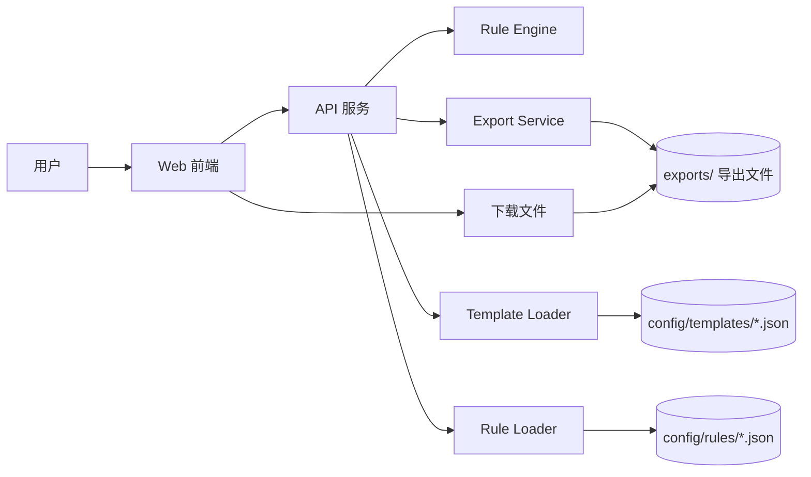
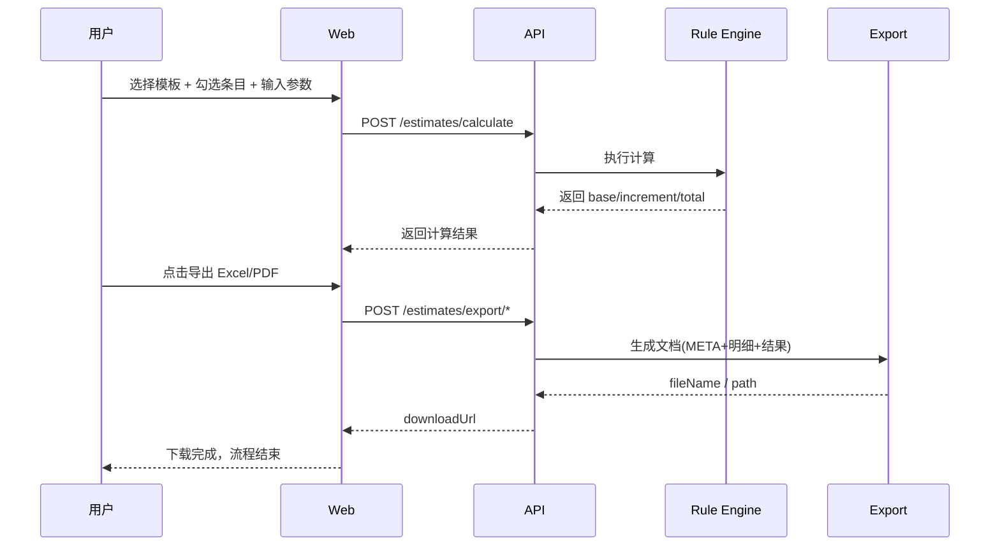

# 轻量级实施人天评估系统 - 架构设计 V2（计算导出型）

## 1. 背景与目标

基于现有估算 Excel 模板（模块报价、基础/专业/高级套件、AI 超级套件、在线交付包），建设一个可快速上线、易维护、便于部署的轻量评估系统。

### 1.1 目标

- 将 Excel 公式固化为可维护的规则引擎，保证结果一致性。
- 支持模板化估算（模块版、套件版、在线交付包）。
- 专注评估计算与结果导出，不建设复杂项目过程管理。
- 每次评估以“会话”方式完成，导出后流程结束。
- 支持单机/轻量部署，降低实施与运维门槛。

### 1.2 非目标（V2 明确不做）

- 不做项目持久化（如项目台账、快照版本管理、历史审批流）。
- 不做复杂用户体系与细粒度 RBAC。
- 不做复杂 BI 平台，仅保留计算结果展示与导出。

## 2. 业务抽象（从 Excel 到系统）

### 2.1 核心业务对象

- `模板 Template`：模块报价、基础/专业/高级套件、AI 超级套件、在线交付包。
- `模板项 TemplateItem`：可勾选估算条目（标准人天、说明、分组关系）。
- `规则 RuleSet`：用户数分段、人天加成、项目难度、多组织系数。
- `估算会话 EstimateSession`：一次临时计算请求（默认不入库）。

### 2.2 计算链路（统一引擎）

1. 选择模板与条目勾选状态。
2. 计算单项小计：`included ? standard_days : 0`。
3. 按分组汇总小计。
4. 计算用户数增量（分段规则）。
5. 计算项目难度增量。
6. 计算多组织增量。
7. 生成总计与明细拆解。

## 3. 总体架构

采用“前端主导 + 后端计算导出”的轻量架构：

- 前端：`Web UI`（录入、实时估算、结果展示、导出触发）
- 后端：`API + Rule Engine + Export`（计算与文档生成）
- 存储：最小化存储（模板与规则可文件化；导出文件短期存储）

### 3.1 架构图（Mermaid）

### 3.2 逻辑组件

- `Template Loader`：加载模板（建议 JSON 或内置配置）。
- `Rule Engine`：执行统一估算规则。
- `Estimate API`：接收输入并返回计算结果。
- `Export Service`：根据计算结果导出 Excel/PDF。

### 3.3 计算与导出流程（Mermaid）

## 4. 技术选型（建议）

### 4.1 前端

- `Vue 3 + TypeScript + Vite`
- `Element Plus`（快速搭建企业后台界面）
- 状态管理：`Pinia`

### 4.2 后端

- `NestJS + TypeScript`
- 规则计算采用纯函数 + 策略模式
- 无强依赖 ORM（仅在需要极简配置落库时再接入 SQLite/PostgreSQL）

### 4.3 数据层

- V2 默认无业务库（模板与规则文件化）
- 可选：`SQLite` 用于极简配置管理（非必须）
- 可选：内存缓存（Node memory）提升重复计算性能

### 4.4 部署

- `Docker Compose` 单机部署（前端 + 后端）
- Nginx 反向代理 + TLS

## 5. 轻量数据策略（V2）

### 5.1 必备持久化对象（最小化）

- `template.json`（模板结构）
- `rules.json`（规则结构）
- `export files`（导出产物，按时间短期保留）

### 5.2 会话数据处理

- 输入参数仅在请求周期内使用，不默认落库。
- 导出时把“输入 + 结果 + 时间”写入导出文档页签，保证可追溯。
- 如需留痕，建议仅保留最近 N 天导出记录（轻量日志）。

## 6. API 设计（V1）

### 6.1 模板与规则

- `GET /api/templates`
- `GET /api/templates/{id}`
- `GET /api/rulesets/active`

### 6.2 估算

- `POST /api/estimates/calculate`（仅计算，不落库）

### 6.3 导出

- `POST /api/estimates/export/excel`
- `POST /api/estimates/export/pdf`

## 7. 交互流程（核心页面）

### 7.1 页面清单（精简）

- 模板选择页
- 估算录入页（分组折叠 + 勾选 + 实时回算）
- 结果页（总计、增量拆解、导出）

### 7.2 关键体验

- 修改勾选或系数后，前端本地预计算 + 后端校验结果双保险。
- 分组小计、总计固定区域展示，避免长表单迷失。
- 提供“恢复默认模板配置”与“一键清空重算”。

## 8. 安全与权限（精简）

- 建议先使用单管理员账号或内网访问控制。
- 若需登录，保留最小角色：`admin`、`operator`。
- 不做复杂审计，仅记录导出操作日志（可选）。

## 9. 部署与运维（轻量）

### 9.1 标准部署形态

- `web`（前端静态资源 + Nginx）
- `api`（NestJS）

### 9.2 环境配置

- `.env.dev`, `.env.prod`
- 关键变量：`APP_BASE_URL`, `EXPORT_STORAGE_PATH`, `EXPORT_FILE_TTL_DAYS`

### 9.3 备份

- 导出文件按日期归档并按 TTL 清理

## 10. 迭代计划（建议）

### Sprint 1（1 周）

- 完成模板文件化、规则引擎、计算 API
- 完成基础估算录入页与结果页

### Sprint 2（1 周）

- 完成套件模板与导出（Excel/PDF）
- 完成导出文档中的输入结果回填（可追溯）

### Sprint 3（0.5-1 周）

- 完成部署脚本、日志清理策略、试点上线

## 11. 关键风险与应对

- 规则口径不一致：建立“规则基线文档 + 评审机制”。
- Excel 历史逻辑隐含差异：通过“样本项目回放”做结果校验。
- 需求膨胀：坚持 MVP 边界，非核心能力进入 V1.1。

---

## 需求评审决议（已确认）

### A. 产品目标层（1）
- 服务对象明确为“售前/实施顾问快速估算场景”，并兼容 Agent 调用。
- 交付形态确定为：`录入 -> 计算 -> 导出 -> 结束`。
- 在轻量原则下扩展“Assessment-as-a-Service”能力，支持机器调用。
- 明确不做：项目台账、快照审批流、复杂 RBAC、多租户、BI 中台。

### B. 业务能力层（2）
- V1 同时支持 Human Path 与 Agent Path。
- V1 必备：`calculate` + `calculate-and-export` 双模式。
- V1 必备：返回 `item -> group -> total` 三层结果拆解。
- V1 必备：返回 `calculationBreakdown` 用于解释性输出。
- V1 必备：幂等键、错误码、`requestId`、基础限流。
- V1.1：需求文档自动抽取参数（Agent 高阶能力）。

### C. 评估流程层（3）（已确认）
- 模板选择：必选 `templateId` + `templateVersion`（或等价 `ruleSetId`），默认不自动升级版本。
- 录入参数：必填 `userCount`、`difficultyFactor`、`orgCount`、`orgSimilarityFactor`、`items[]`；`userCount`/`orgCount` ≥ 0；系数须命中规则枚举。
- 计算执行：前端可本地预估，以后端权威结果为准（导出与 Agent 均以服务端为准）。
- 导出执行：支持 `calculate`（仅 JSON）与 `calculate-and-export`（下载链接）；导出文件含 `META`（输入、规则版本、导出时间、`requestId`）。
- 结束与留存：用户拿到 JSON 或文件即流程结束；导出文件默认 TTL 7 天（可配置）。

### D. 计算规则层（4）（已确认：可配置抽象）
- 计算规则采用“参数化/规则化”设计，不在代码中硬编码业务口径。
- 后台可配置的核心抽象：
  - `grouping`：分组层级与聚合维度
  - `itemRule`：单项计算（如 included 判定、默认值、覆盖规则）
  - `baseRule`：基准人天计算（求和范围、过滤条件、聚合方式）
  - `orgIncrementRule`：多组织增量计算（公式、参数、适用模板）
- 规则引擎执行顺序可配置（pipeline），至少支持：
  - `item -> group -> base -> userIncrement -> difficultyIncrement -> orgIncrement -> total`
- 每条规则需具备版本与启停能力，支持按模板绑定（`templateType/templateId`）。
- 口径变更通过“改配置 + 发布规则版本”完成，不通过改代码完成。

### E. 页面与交互层（5）（已确认）
- 页面固定三页：模板选择、估算录入、结果与导出；规则摘要以侧滑/抽屉只读展示，不单独占整页（V1）。
- 必须先完成后端权威计算，再允许导出；导出前展示确认摘要。
- 结果页展示 `calculationBreakdown`、`requestId`，并提供复制 JSON。
- 前端视觉：**Calendly 风格**（极简、干净、大留白、卡片化、品牌蓝主按钮 + 灰描边次要按钮）。
- 视觉规范与参考图见：`02_产品设计/前端视觉规范-Calendly风格-V2.md`；参考截图：`04_开发实现/前端/refero.design 7127269a-42c0-45e1-938f-0e0b2881a1ba.jpg`。

### F. 需求变更（本轮新增）：用户端非黑盒可视化录入
- 用户端必须展示原始需求 Excel 的结构化层级：`group -> item`，不得仅保留黑盒参数输入。
- 用户可在系统界面对每个 `TemplateItem` 进行手动勾选/反勾选，勾选结果直接作为计算输入的 `items[]`。
- 页面应提供“全选/全不选”与分组小计预览，降低批量操作成本并提升可解释性。
- 前端本地预览仅用于交互反馈；导出与最终口径仍以后端权威计算为准。

## 附：V1 验收标准（建议）

- 与 Excel 对比样本（>=20 个）结果一致率 100%。
- 主流程（录入->计算->导出）全链路可用。
- 单项目估算页面响应时间 < 1s（常规模板规模）。

