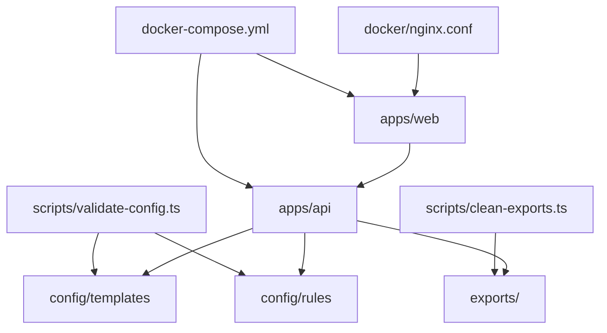
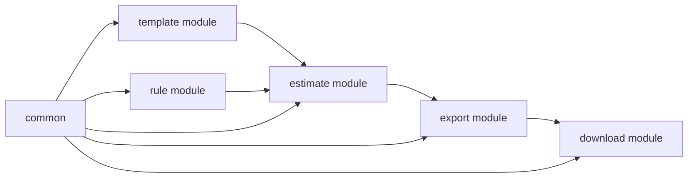

# 工作量评估系统 - 工程脚手架方案 V2（轻量）

## 1. 推荐目录结构

```text
workload-estimator/
  apps/
    web/                      # Vue3 前端
    api/                      # NestJS 后端
  config/
    templates/                # 模板 JSON
    rules/                    # 规则 JSON
  exports/                    # 导出文件目录（运行时）
  scripts/
    clean-exports.ts          # 导出文件清理
    validate-config.ts        # 模板/规则校验
  docker/
    nginx.conf
  docker-compose.yml
  .env.example
  README.md
```

### 1.1 工程模块图（Mermaid）



## 2. 前端模块拆分（`apps/web`）

### 2.0 UI 风格（评审已确认）
- 参考 **Calendly** 极简仪表盘风格；设计 tokens 与组件约定见 `02_产品设计/前端视觉规范-Calendly风格-V2.md`。
- 参考图路径：`04_开发实现/前端/refero.design 7127269a-42c0-45e1-938f-0e0b2881a1ba.jpg`。
- 技术栈仍为 Vue3 + Element Plus，但需 **主题覆盖**（主色、圆角、Tab、卡片、按钮），避免默认后台样式。

- `src/pages/TemplateSelectPage.tsx|vue`
- `src/pages/EstimateFormPage.tsx|vue`
- `src/pages/EstimateResultPage.tsx|vue`
- `src/components/GroupTable.*`
- `src/components/FactorPanel.*`
- `src/services/estimateApi.ts`
- `src/types/estimate.ts`

关键点：
- 本地维护当前估算会话状态（不落后端）
- 计算按钮调用后端校验，避免前端口径漂移
- 导出前固定展示“最终确认摘要”

## 3. 后端模块拆分（`apps/api`）

- `src/modules/template/`（读取模板配置）
- `src/modules/rule/`（读取规则配置）
- `src/modules/estimate/`（计算逻辑）
- `src/modules/export/`（Excel/PDF 生成）
- `src/modules/download/`（文件下载）
- `src/common/`（DTO、异常、日志、拦截器）

### 3.1 后端内部关系图（Mermaid）



核心文件建议：
- `estimate.engine.ts`：纯函数计算入口
- `estimate.validators.ts`：输入校验
- `export.excel.ts` / `export.pdf.ts`：导出实现

## 4. 首批 API 落地顺序

1. `GET /api/v1/templates`
2. `GET /api/v1/templates/{id}`
3. `GET /api/v1/rule-sets/active`
4. `POST /api/v1/estimates/calculate`
5. `POST /api/v1/estimates/export/excel`
6. `POST /api/v1/estimates/export/pdf`
7. `GET /api/v1/downloads/{fileName}`

## 5. 配置文件规范

### 5.1 模板配置
- 每个模板一个 JSON 文件，如：
  - `config/templates/module_quote.json`
  - `config/templates/suite_basic.json`

### 5.2 规则配置
- 全局规则：
  - `config/rules/default.json`
- 可选模板特化规则：
  - `config/rules/suite_advanced.json`

### 5.3 配置校验
- 启动时自动校验配置合法性（Schema Validation）
- 校验失败阻止服务启动，避免线上误算

## 6. 导出策略

- 命名规范：`estimate-{yyyyMMdd-HHmmss}-{rand}.xlsx|pdf`
- 导出内容：
  - 结果页
  - 明细页
  - `META` 页（输入参数、规则版本、导出时间）
- 清理策略：
  - 默认保留 7 天
  - 定时任务每天执行一次

## 7. 部署脚手架（最小）

## 7.1 `docker-compose.yml`
- `web`：Nginx 托管前端静态文件
- `api`：Node 服务
- 挂载目录：`./exports:/app/exports`

## 7.2 环境变量（`.env.example`）
- `APP_PORT=8080`
- `EXPORT_STORAGE_PATH=/app/exports`
- `EXPORT_FILE_TTL_DAYS=7`
- `NODE_ENV=production`

## 8. 代码质量基线

- TypeScript 严格模式开启
- ESLint + Prettier
- 核心计算函数单测覆盖率 >= 90%
- 导出模块集成测试至少 3 条（Excel、PDF、非法输入）
