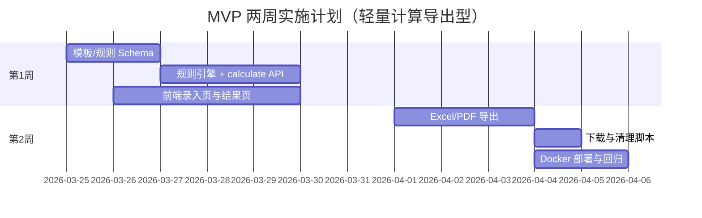

# 工作量评估系统 - 开发实施清单 V2（轻量计算导出型）

> **对齐说明**：清单仍以 MVP「计算 + 导出」为主线；当前仓库已额外实现登录、版本、多页签工作台等能力。详见 `03_技术设计/系统演进/实现与文档对齐说明.md`。

## 1. 实施目标

在最短周期内交付“可用的评估计算工具”：
- 支持模板选择与勾选录入
- 支持实时计算（与 Excel 规则一致）
- 支持导出 Excel/PDF
- 导出后流程结束，不做项目持久化

## 2. 交付范围（MVP）

### 2.1 必做
- 模板加载（JSON）
- 规则加载（JSON）
- 估算计算 API
- 导出 API（Excel/PDF）
- 前端录入页 + 结果页
- Docker 单机部署

### 2.2 暂缓
- 项目管理、快照管理、审批流
- 复杂用户权限体系
- 后端业务数据库

## 3. 任务拆解（按优先级）

### 3.0 实施路线图（Mermaid）

## P0 - 计算主链路
- [ ] 定义模板 JSON Schema
- [ ] 定义规则 JSON Schema
- [ ] 实现规则引擎核心函数（单项/分组/总计/增量）
- [ ] 实现 `POST /api/v1/estimates/calculate`
- [ ] 用 Excel 样本构建回归用例（>=20组）

## P0 - 导出闭环
- [ ] 实现 `POST /api/v1/estimates/export/excel`
- [ ] 实现 `POST /api/v1/estimates/export/pdf`
- [ ] 导出文件嵌入 `META` 信息（输入参数、规则版本、时间）
- [ ] 提供下载接口 `GET /api/v1/downloads/{fileName}`
- [ ] 导出文件 TTL 清理脚本

## P0 - 前端可用性
- [ ] 模板选择页
- [ ] 估算录入页（分组折叠、批量勾选）
- [ ] 结果页（总计、增量拆解、分组小计）
- [ ] 一键导出按钮（Excel/PDF）
- [ ] 错误提示与参数校验（用户数、组织数、系数）

## P1 - 运维可交付
- [ ] 编写 `docker-compose.yml`
- [ ] 编写 `.env.example`
- [ ] 编写部署说明与启动脚本
- [ ] 增加健康检查接口 `/health`

## 4. 验收标准

- 计算结果与原 Excel 对齐：一致率 100%
- 单次计算响应：< 1 秒（常规模板）
- 导出成功率：> 99%
- 新环境可在 30 分钟内完成部署并可用

## 5. 建议工期

- 第 1 周：规则引擎 + calculate API + 前端录入页
- 第 2 周：导出能力 + Docker 部署 + 回归校验

## 6. 风险与应对

- 规则口径遗漏：建立“Excel -> JSON 映射核对清单”
- 导出格式差异：先确保数据正确，再迭代版式
- 前端性能波动：分组懒渲染 + 本地缓存计算结果
