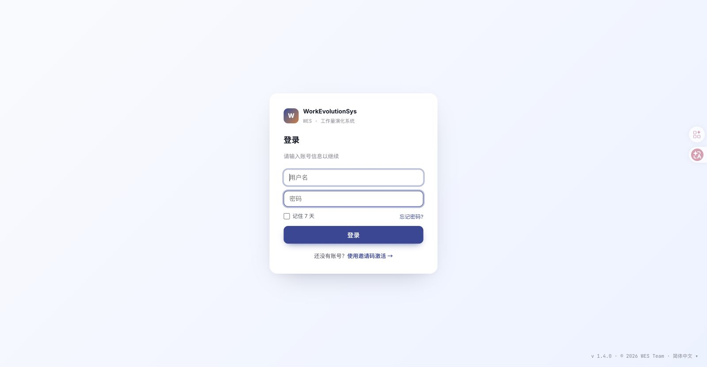

# RP-043 System Management Dialog QA

## Audit scope

- Surface: System Management shared Dialog pilot
- Routes requested: `/system/code-rules`, `/system/model-config`
- Target evidence: desktop 1440px, narrow 760px, keyboard focus/Escape/restore, header drag, save/cancel behavior
- Run date: 2026-07-25
- Status: **implemented / automated verification passed / manual browser acceptance pending**

## Current-run environment

- API: local `apps/api`, port 3000, started successfully
- Web: local `ui/V2_PROTOTYPE`, port 3002, started successfully
- Primary capture attempt: Codex in-app browser
- Authentication fallback attempt: existing Chrome profile
- Captured Chrome viewport: 1599 × 830 CSS px, DPR 2
- Browser console errors on the login wall: none

## Step evidence

| Step | Route / viewport | Tested interaction | Evidence | Result / health |
|---|---|---|---|---|
| 1 | `/system/code-rules`, current desktop viewport | Reach protected System Management route with an admin session | [00-authentication-blocked.png](assets/rp-043/00-authentication-blocked.png) | **Blocked** — both the in-app browser and the existing Chrome profile redirected to `/login`; no valid admin session was available |
| 2 | `/system/code-rules`, 1440px target | Open rule configuration; inspect title, close control, initial focus, Escape, focus restore, drag clamp, save/cancel | Authentication blocker from Step 1 | **Pending** — protected page was not reached; no rendered Dialog claim is made |
| 3 | `/system/model-config`, 1440px target | Open first model editor; inspect wide Dialog and cancellation behavior | Authentication blocker from Step 1 | **Pending** — protected page was not reached; no rendered Dialog claim is made |
| 4 | System Management Dialog, 760px target | Verify max height, body scrolling, reachable actions, and page scrolling | Authentication blocker from Step 1 | **Pending** — responsive behavior was not visually verified |
| 5 | Rule/model dialogs, keyboard path | Tab/Shift+Tab loop, Escape close, focus return to opener | Automated component and page tests only | **Automated pass / manual pending** — tests are evidence for behavior, not a substitute for a live keyboard run |

## Accepted screenshot

The saved screenshot was reopened and inspected. It shows the current local WES login page, without loading, crop, blank state, or exposed credential values. It is accepted only as evidence of the authentication blocker, not as System Management visual evidence.

## Automated evidence

- Focused Dialog/System Management verification: 4 test files, 13 tests passed.
- Full Web verification: 23 test files, 128 tests passed.
- Production Web build: passed; 114 modules transformed.
- Existing non-blocking warnings remain:
  - React Router v7 future-flag notices in tests.
  - Vite chunk-size warning for a 606.21 kB minified JavaScript chunk.
- UI scope checker: no new deterministic UI findings.

## Evidence limits and next acceptance action

- No password, token, cookie, or private credential was read from the browser or written into project evidence.
- The known public development default did not match the active local users. No password reset, auth bypass, user mutation, or temporary production-code bypass was attempted.
- Desktop Dialog screenshots, 760px screenshots, pointer drag, and manual keyboard behavior remain `待回填`.
- To complete manual acceptance, sign in to the retained local Chrome login tab with an active admin account, then repeat Steps 2–5 and replace the pending rows with current-run screenshots and observed results.
