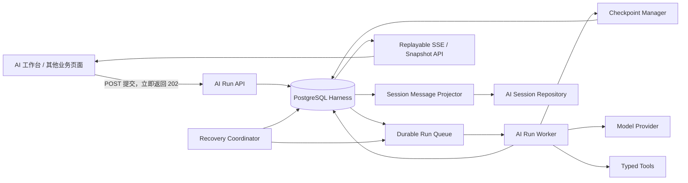

# RP-047 WES AI 多通道与可恢复检查点运行时设计

**日期：** 2026-08-02

**需求：** RP-047

**问题来源：** ISS-2026-08-02-003

**状态：** 核心方案已获用户确认，书面规格待用户复核

**执行方式：** Qoder 分批实现，Codex 逐批复核，用户保留最终验收权

**项目入口：** `/Users/kevin/AI/Workload-evaluation-system`

## 1. 最终产品结论

WES AI 任务必须从“浏览器请求”升级为“服务端持久任务”。

- 用户切换 AI 会话，原会话任务继续运行。
- 用户离开 AI 页面去填写其他表单，任务继续运行。
- 用户刷新页面、关闭浏览器标签页、退出登录后，任务继续运行。
- 网络断开或 SSE 连接关闭，只代表用户暂时不再观看，不代表取消任务。
- 只有用户明确点击“停止任务”，或管理员基于安全策略强制停止，任务才进入取消流程。
- API/Worker 重启、进程异常或模型调用失败后，系统从最近一个兼容且已完成的检查点恢复。
- 模型调用不能从中间 token 继续；若模型生成中断，应从该模型调用之前的稳定检查点重新执行该逻辑步骤。

这不是单纯的前端 `Map<sessionId, state>` 改造。前端隔离只能解决切换显示问题，无法满足关页、重新登录和服务端重启后继续执行。任务生命周期的唯一权威必须在服务端。

## 2. 目标与非目标

### 2.1 目标

1. 支持不同会话的 AI 任务并行执行，同一会话保持单任务顺序一致性。
2. 将任务执行、进度、部分输出、最终结果和取消状态持久化。
3. 让浏览器在任意时刻重新连接并恢复任务视图。
4. 通过混合检查点减少服务重启或故障后的重复工作。
5. 防止恢复过程重复创建业务记录、重复调用有副作用工具或重复写入 AI 回复。
6. 保持 JWT、owner 数据隔离、确认闸门和 Harness 审计能力。
7. 在不为其他传统 WES 模块引入数据库主路径的前提下，复用已获准使用 PostgreSQL 的 Harness 域。

### 2.2 非目标

- 不承诺从模型输出的某个 token 精确续写。
- 不允许 AI 自己直接写数据库检查点。
- 不把浏览器 `localStorage` 作为任务恢复事实源。
- 不在第一阶段引入 Redis、Kafka 或第二套工作流平台。
- 不让任务恢复绕过用户确认、JWT 权限或 owner 隔离。
- 不保证未发送的输入草稿跨设备同步；未发送草稿只在当前浏览器按用户和会话保存。
- 不在本需求中迁移整个 AI Session 域到 PostgreSQL。

## 3. 当前实现与根因

当前 `AiHomeWorkbench.jsx` 使用全局 `sending`、`messages`、`composer` 和 `activeSession`。切换会话时，旧请求仍持有全局回调，导致冻结、跨会话错写和全局发送锁。

现有 `/api/v1/ai/home-workbench/chat/stream` 将执行生命周期绑定在 HTTP/SSE 请求上。客户端关闭连接后，服务端把运行标记为 `client_aborted`。这与“用户离开页面但后台继续运行”的产品要求相反。

Harness 已有 PostgreSQL 主存储、`harness_runs.ai_session_id`、产物、工具事件、模型运行轨迹和部分幂等处理，但还缺少：

- 持久队列与后台 Worker；
- Run Attempt、worker lease 和 heartbeat；
- 可恢复检查点；
- 可回放的运行事件和部分输出；
- Recovery Coordinator；
- 与 AI Session 消息存储之间的幂等投影。

因此本方案复用 Harness 作为持久执行所有者，而不是继续扩大全局前端状态。

## 4. 核心领域边界

### 4.1 AI Session

AI Session 负责用户可见的会话语义：

- 会话标题、消息历史和附件引用；
- 当前用户对该会话的访问权；
- 一个会话中的消息顺序；
- 最终回复在会话中的呈现。

AI Session 不负责持有 worker、心跳、重试次数或恢复游标。

### 4.2 Harness Run

Harness Run 是任务生命周期的唯一服务端权威：

- 绑定 `ownerUserId` 和 `aiSessionId`；
- 保存提交输入、工作流版本和模型配置快照；
- 记录状态、步骤、尝试、检查点、输出和事件；
- 管理取消、恢复和幂等副作用；
- 最终把用户消息和 AI 回复幂等投影回 AI Session。

### 4.3 前端 Session Runtime

前端只负责：

1. 提交任务；
2. 订阅任务事件；
3. 重新进入时恢复视图；
4. 显示多个会话的独立状态；
5. 发起明确取消。

前端组件卸载、路由切换、刷新和登出不得触发取消接口。

## 5. 目标架构



### 5.1 进程形态

- API 进程只做鉴权、提交、查询、订阅和取消请求，不在 HTTP 请求内完成整个 AI 任务。
- Worker 使用独立入口运行，与 API 共用 `apps/api` 代码包和 Harness repository。
- 本地开发可通过显式配置在同一 Node 进程启动一个 Worker，但生产语义仍按独立 worker 设计。
- 第一阶段使用 PostgreSQL 行锁和 `FOR UPDATE SKIP LOCKED` 认领任务，不引入 Redis。
- Worker 并发由 `AI_RUN_WORKER_CONCURRENCY` 配置；超过容量的任务保持 `queued`，而不是丢失或占用浏览器连接。

## 6. 运行模型与状态机

### 6.1 Run 分类

`harness_runs` 增加：

- `runKind`：首批至少支持 `workbench_chat`、`file_analysis`、`replay`、`regression`；
- `workflowId`、`workflowVersion`；
- `currentStepKey`；
- `submissionKey`：同一用户提交的幂等键；
- `cancelRequestedAt`、`cancelRequestedBy`；
- `recoveryCount`、`lastCheckpointId`；
- `executionConfig`：去密后的 prompt/model/tool 版本快照。

现有文件分析阶段继续存在，但 `stage` 改为由 `runKind + workflowVersion` 对应的工作流注册表校验，避免用一套文件分析阶段强行表达所有聊天任务。

### 6.2 Run 状态

```text
queued
  → running
  → completed

running
  → waiting
  → running

running
  → recovering
  → running

任何非终态
  → cancelling
  → cancelled

running / recovering
  → failed
```

- `queued`：任务已持久化，等待 Worker。
- `running`：某个有效 attempt 正在执行。
- `waiting`：等待用户确认或补充输入，不占 worker lease。
- `recovering`：原 attempt 已失效，正在选择检查点并创建新 attempt。
- `cancelling`：已收到明确取消请求，等待当前安全边界停止。
- `completed`、`failed`、`cancelled`：终态。

普通登出、token 过期、路由切换、SSE 断开均不改变 Run 状态。账号被管理员禁用属于安全事件，可以触发系统取消，不等同于普通登出。

### 6.3 并发规则

- 每个 AI Session 同一时刻最多一个非终态执行型 Run，保证消息和工具副作用顺序。
- 不同 AI Session 可被不同 Worker 并行认领。
- 同一会话有活动 Run 时再次提交，API 返回 `409 SESSION_RUN_ACTIVE` 和活动 `runId`，前端跳回该任务，而不是静默丢弃。
- 如果活动 Run 正处于 `waiting`，用户的补充内容必须通过该 Run 的 input/confirm 接口继续原任务，不创建第二个 Run。
- Worker 总并发由部署配置控制；队列自然提供背压。

## 7. 持久化数据设计

所有新增表属于 Harness 域，继续遵守 Harness 已获批准的 PostgreSQL 边界。

### 7.1 `harness_run_attempts`

每次 Worker 认领或故障恢复都会创建独立 attempt：

| 字段 | 作用 |
|---|---|
| `attempt_id` | 主键 |
| `harness_run_id` | 所属 Run |
| `attempt_no` | 从 1 递增，同一 Run 唯一 |
| `worker_id` | 执行实例标识 |
| `status` | `claimed/running/succeeded/failed/orphaned/cancelled` |
| `lease_expires_at` | Worker 租约截止时间 |
| `heartbeat_at` | 最近心跳 |
| `resume_checkpoint_id` | 本 attempt 从哪个检查点恢复 |
| `started_at/ended_at` | 生命周期时间 |
| `error_code/error_message` | 去敏后的失败信息 |

约束：同一 Run 只能有一个 `claimed/running` attempt。

### 7.2 `harness_run_checkpoints`

检查点只追加，不原地覆盖：

| 字段 | 作用 |
|---|---|
| `checkpoint_id` | 主键 |
| `harness_run_id/attempt_id` | 所属 Run 与产生它的 attempt |
| `sequence` | Run 内严格递增序号 |
| `checkpoint_key` | 逻辑幂等键 |
| `kind` | `structural/semantic/combined` |
| `stage/step_key` | 已完成的稳定步骤 |
| `semantic_label/summary` | AI 建议、Runtime 审核后的业务里程碑说明 |
| `next_step_key` | 恢复后应执行的下一步 |
| `resume_policy` | `resume_next/restart_step/manual` |
| `state_snapshot` | 结构化、去敏、可验证的恢复状态 |
| `context_hash` | 上下文一致性校验 |
| `resume_contract_version` | 恢复结构版本 |
| `workflow_version` | 工作流版本 |
| `prompt_profile_id/prompt_version` | Prompt 固定版本 |
| `provider/model/model_config_hash` | 模型执行配置快照 |
| `artifact_refs/tool_event_refs/message_refs` | 已提交事实引用 |
| `effect_keys` | 已完成副作用的幂等键集合 |
| `created_at` | 创建时间 |

唯一约束：`(harness_run_id, checkpoint_key)`、`(harness_run_id, sequence)`。

检查点不得保存 API Key、token、cookie、私钥、未脱敏整份 prompt 或无边界的原始文件全文。原始大对象只保存受控引用和哈希。

### 7.3 `harness_run_events`

持久化 Run 的可回放事件：

- `run_queued`
- `attempt_started`
- `stage_changed`
- `checkpoint_committed`
- `output_updated`
- `waiting_for_user`
- `recovery_started/recovery_completed`
- `cancel_requested/run_cancelled`
- `run_completed/run_failed`

每条事件有 Run 内递增 `sequence`。SSE 使用该序号作为 `id`，支持 `Last-Event-ID` 和 `after` 游标重放。

事件序号通过对 `harness_runs.event_sequence` 的事务内原子递增分配，不能用进程内计数器，确保多 Worker 下仍保持唯一和有序。

模型 token 不逐 token 入库。Worker 将文本合并后，按“累计至少 1KB 或距上次持久化至少 500ms”写一次输出更新，降低数据库写放大。

### 7.4 `harness_run_outputs`

保存当前可恢复输出快照：

- 当前 assistant 文本；
- 结构化卡片/产物引用；
- 输出版本号；
- `partial/final` 状态；
- 最终 Session message 引用；
- 内容哈希和更新时间。

客户端首次恢复时先读 snapshot，再从 snapshot 对应事件游标继续订阅，避免必须重放整个 token 历史。

### 7.5 `harness_session_outbox`

Harness 与仍使用文件存储的 AI Session 之间不能做跨存储事务，因此使用 outbox + 幂等投影：

- 用户消息、最终 AI 回复、任务失败提示分别形成 outbox 事件；
- `Session Message Projector` 以 `sourceEventId/clientMessageId/sourceRunId` 写入 AI Session；
- AI Session append 操作先检查相同来源键，存在则返回已有消息；
- 如果进程在“Session 已写入、outbox 未确认”之间崩溃，重放不会产生重复消息。

这提供“至少一次投递 + 业务层幂等”，不伪称跨 PostgreSQL 与 JSON 文件的全局事务。

## 8. 混合检查点机制

### 8.1 谁决定插旗

检查点由两类信号共同决定：

1. **Runtime 结构检查点**：输入已落库、上下文已固定、工具结果已提交、产物已提交、最终消息已提交等可机器验证边界。
2. **AI 语义检查点建议**：模型在结构化输出中返回 `checkpointHint`，说明“现在完成了哪个业务里程碑、下一步是什么”。

模型只能建议：

```json
{
  "checkpointHint": {
    "semanticLabel": "已完成需求范围澄清",
    "summary": "客户范围、组织范围和接口边界已形成稳定结论",
    "nextStepKey": "generate_rough_estimate"
  }
}
```

Checkpoint Manager 只有在以下条件全部成立后才写检查点：

- 当前步骤 Schema 校验通过；
- 本步骤声明的数据库写入、产物和工具结果已提交；
- 幂等副作用已有稳定 `effectKey`；
- `nextStepKey` 属于当前固定工作流版本；
- 状态快照通过去敏、大小和引用完整性校验；
- 没有处于结果未知的非幂等外部调用。

### 8.2 默认检查点边界

| 检查点 | 类型 | 恢复语义 |
|---|---|---|
| `input_committed` | structural | 从上下文解析开始 |
| `context_resolved` | combined | 从意图路由或计划步骤开始 |
| `intent_routed` | combined | 从已选择工作流的首个执行步骤开始 |
| `tool_result_committed:<effectKey>` | structural | 跳过已提交工具副作用，继续下一步 |
| `artifact_committed:<artifactKey>` | combined | 复用已提交产物，继续后续处理 |
| `model_input_ready:<stepKey>` | structural | 若模型中途失败，重新执行本模型调用 |
| `awaiting_user_confirmation:<actionId>` | combined | 恢复为等待状态，不重复执行待确认动作 |
| `final_response_committed` | structural | 只补 Session 投影或结束，不重新生成回复 |

### 8.3 兼容性判定

恢复前必须同时满足：

- `resumeContractVersion` 受当前 Runtime 支持；
- Run 固定的 `workflowVersion` 仍可加载；
- `contextHash` 与恢复输入一致；
- 引用的 artifact、tool event 和附件仍存在且 owner 一致；
- 固定的 prompt/model 配置可重建；
- `nextStepKey` 仍属于该工作流版本。

不兼容时不得猜测恢复。Run 进入 `failed`，错误码为 `RECOVERY_CHECKPOINT_INCOMPATIBLE`，向用户提供“从头重试”入口。

## 9. 幂等与副作用安全

恢复的核心不是“再跑一次”，而是“已经完成的事实不重复发生”。

### 9.1 逻辑副作用键

每个有副作用的步骤使用与 attempt 无关的稳定键：

```text
effectKey = <runId>:<workflowVersion>:<logicalStepKey>:<effectOrdinal>
```

- attempt 变化不能改变 `effectKey`；
- 工具事件对 `(runId, effectKey)` 唯一；
- 产物对 `(runId, artifactType, logicalVersion)` 唯一；
- 最终会话回复对 `sourceRunId` 唯一；
- 用户提交对 `ownerUserId + submissionKey` 唯一。

### 9.2 工具恢复分级

- **只读工具**：可安全重试，但仍记录输入哈希和结果引用。
- **内部幂等写工具**：使用 `effectKey`，重复调用返回已存在结果。
- **外部支持幂等键的工具**：透传稳定 idempotency key。
- **外部非幂等且结果未知的工具**：禁止自动恢复，进入 `manual`，要求人工核实后继续。
- **高风险工具**：即使可幂等，也不能绕过原有用户确认闸门。

## 10. Worker 租约与自动恢复

### 10.1 租约

- Worker 认领任务时创建 attempt，并获得 45 秒 lease。
- 执行期间每 15 秒 heartbeat 一次。
- 正常优雅停机先停止认领新任务，在安全步骤边界释放或结束 attempt。
- 进程硬退出时 lease 自然过期，不依赖内存清理。

### 10.2 Recovery Coordinator

Recovery Coordinator 每 10 秒扫描：

- `running/recovering/cancelling` 且有效 lease 已过期的 Run；
- `queued` 且尚无有效 attempt 的 Run；
- 未投影完成的 Session outbox 事件。

针对失联 Run：

1. 使用数据库事务和行锁确保同一 Run 只有一个恢复者。
2. 将旧 attempt 标记为 `orphaned`。
3. 若已有取消请求，直接进入取消收尾。
4. 从后向前寻找最近一个兼容、已提交的检查点。
5. 创建新 attempt，记录 `resumeCheckpointId`。
6. 将 Run 标为 `recovering`，再放回可认领队列。
7. 新 Worker 加载固定工作流和版本，从 `nextStepKey` 继续。

每个 Run 最多自动恢复 3 次，退避为 2 秒、10 秒、30 秒。超过次数后进入 `failed`，错误码 `RECOVERY_LIMIT_EXCEEDED`，保留人工重试入口和完整证据。

### 10.3 模型调用中断

模型 provider 不提供 token 级断点恢复。Worker 在调用模型之前写 `model_input_ready` 检查点；若进程在流式生成中断：

- 丢弃未提交为 final 的部分模型输出；
- 复用固定输入、prompt 和模型配置；
- 重新执行该模型步骤；
- 仅在完整输出通过 Schema/业务校验后，提交产物和后置检查点。

用户明确取消时，Worker 将服务端创建的 `AbortSignal` 传给 provider 和可取消工具，在最近安全边界停止。这个 signal 来自持久化的 `cancelRequestedAt`，与浏览器 SSE 连接状态无关。

UI 可以展示上一次 attempt 的部分文本为“已中断的临时输出”，但不能把它当成最终消息，也不能与新 attempt 文本拼接成伪连续输出。

## 11. API 契约

所有接口使用 JWT，响应保持 `{ code, message, data }`。

### 11.1 提交任务

`POST /api/v1/ai-sessions/:sessionId/runs`

请求：

```json
{
  "submissionKey": "client-generated-uuid",
  "clientMessageId": "client-generated-uuid",
  "content": "请分析这份需求文件",
  "attachmentIds": ["attachment-id"],
  "workflowHint": "file_analysis"
}
```

返回 HTTP 202：

```json
{
  "code": 0,
  "message": "任务已进入后台执行",
  "data": {
    "runId": "uuid",
    "sessionId": "session-id",
    "status": "queued",
    "eventCursor": 1
  }
}
```

重复 `submissionKey` 返回同一 `runId`。会话不属于当前用户时返回 404，避免泄露资源存在性。

### 11.2 跨会话任务查询

- `GET /api/v1/ai-runs?status=active`：当前用户所有活跃任务，供全局壳层和登录后恢复。
- `GET /api/v1/ai-runs/:runId`：Run、当前 attempt、最近检查点、输出 snapshot 和错误摘要。
- `GET /api/v1/ai-runs/:runId/events?after=<sequence>`：可回放 SSE；同时支持 `Last-Event-ID`。
- `POST /api/v1/ai-runs/:runId/cancel`：明确取消，HTTP 202。
- `POST /api/v1/ai-runs/:runId/inputs`：为 `waiting` Run 提交补充信息，并继续同一个 Run。
- `POST /api/v1/ai-runs/:runId/actions/:actionId/confirm`：复用现有确认闸门语义，幂等确认后继续。
- `POST /api/v1/ai-runs/:runId/retry`：仅允许重试终态失败 Run；创建带 `retryOfRunId` 的新 Run，原 Run 保持不可变。自动故障恢复才会在同一 Run 内创建新 attempt。

SSE 心跳只保活连接。连接关闭不得调用 cancel，也不得把 Run 标为 aborted。

### 11.3 Session 删除规则

- 重命名、切换和普通归档不影响 Run。
- Session 存在非终态 Run 时，硬删除返回 `409 SESSION_HAS_ACTIVE_RUN`。
- 用户应先明确停止任务，等待进入终态后再删除。

## 12. 前端体验

### 12.1 状态分层

前端新增两层状态：

1. `BackgroundRunProvider` 放在登录后的 Shell 层，保存当前用户所有活跃 Run 摘要，不依赖 AI 页面是否挂载。
2. `SessionRuntimeStore` 以 `sessionId` 为键，保存消息视图、Run 状态、事件游标、未发送 composer 草稿和 unread 标记。

页面不再使用全局 `sending`。当前会话的 `sending` 由该会话是否存在 `queued/running/recovering/cancelling` Run 派生。

### 12.2 会话列表

SessionRail 显示：

- 排队中；
- 执行中；
- 恢复中；
- 等待确认；
- 已完成且未读；
- 失败；
- 已取消。

切换会话只切换渲染源，不取消请求、不清空其他会话状态。

### 12.3 离开 AI 页面

用户进入表单或其他业务页面后：

- Shell 显示后台 AI 任务数量和状态；
- 任务完成时显示一次通知；
- 点击通知返回对应 Session 和 Run；
- 页面卸载只关闭本地 SSE，不改变服务端任务。

### 12.4 刷新、关页与重新登录

登录后的恢复顺序：

1. 拉取 AI Sessions；
2. 拉取当前用户 active/recent Runs；
3. 将 Run 按 `aiSessionId` 合并到 SessionRuntimeStore；
4. 读取 Run snapshot；
5. 从持久 cursor 继续订阅事件；
6. 对已完成但未读的任务显示提醒。

未发送 composer 按 `userId + sessionId` 存在浏览器本地；登出清理敏感运行缓存，但不取消服务端 Run。

## 13. 安全、隐私与审计

- 所有 Run、Attempt、Checkpoint、Output、Event 查询必须校验 `ownerUserId`。
- 管理员审计可以使用独立 capability 查看必要摘要，但不能通过普通 owner API 伪装用户操作。
- checkpoint/outbox/event payload 经过统一 redaction 和大小限制。
- Prompt 原文、附件原文和密钥只保存受控引用；checkpoint 保存版本与 hash。
- 取消、恢复、重试、强制停止都写审计事件。
- 高风险动作继续使用现有 Pending Action / Manual Confirmation 机制。
- 日志不得打印完整 prompt、原始附件内容、JWT 或 provider 密钥。

## 14. 兼容与迁移策略

1. 新异步路径由 `WES_AI_DURABLE_RUNS_ENABLED` 控制，默认先在测试环境启用。
2. 现有同步/请求耦合接口暂时保留，作为回滚通道；新 UI 启用后不再作为主发送路径。
3. 旧 Session 没有 Run 记录时仍按历史消息正常显示。
4. 现有 Harness file-analysis Run 通过迁移默认补齐 `runKind=file_analysis` 和固定 legacy workflow version。
5. 数据库迁移只新增 Harness 域表、索引和列，不修改其他 JSON 业务域的主存储边界。
6. 新旧路径并存期间，最终消息都必须带来源键，避免同一任务被两条路径重复写入。
7. 功能稳定并完成生产观察后，再单独立项下线旧 `/ai/home-workbench/chat/stream` 执行语义；本需求不直接删除回滚通道。

### 14.1 回滚规则

- 关闭 `WES_AI_DURABLE_RUNS_ENABLED` 后，新提交回到旧入口；已进入 durable queue 的任务仍由 Worker安全跑完，不能遗弃。
- `WES_AI_RUN_WORKER_PAUSED=true` 只暂停认领新任务，不取消正在执行或已排队的 Run。
- 新数据库迁移保持 additive，不在同一版本删除旧列、旧接口或旧数据。
- 回滚演练必须验证：旧路径可提交、durable Run 可查询、重新启用 Worker 后 queued Run 能继续。

## 15. 运行监控与保留策略

至少采集以下指标：

- queue depth 与最老 queued Run 等待时间；
- active worker、lease expiry、orphaned attempt 数量；
- checkpoint 写入成功率、平均大小、距最近检查点时长；
- 自动恢复次数、成功率、失败原因和恢复耗时；
- 被 effectKey 阻止的重复副作用次数；
- outbox backlog、投影延迟和重复投影命中次数；
- SSE 当前连接数、重连次数和事件重放数量；
- 各 provider 的耗时、失败率和取消率。

告警至少覆盖：队列持续积压、无活跃 Worker、lease 大量过期、恢复失败率突增、outbox 堆积和 checkpoint 连续写入失败。

Run 活跃期间不得清理其 attempt、checkpoint、event、output 或 outbox。终态数据沿用 Harness 审计保留策略；在尚无统一策略前不自动删除。后续若做事件压缩，只能压缩已完成 Run 的高频 `output_updated`，必须保留最终 output、生命周期事件、checkpoint、tool/model trace 和审计引用。

## 16. Qoder 分批执行方案

本需求横跨数据库、后台执行、API 和前端，不允许作为一个超大 diff 一次性交付。Qoder 按以下顺序执行，每批一个独立 worktree、分支、提交和 handoff；Codex 复核通过后才发布下一批工单。

### 批次 A：持久运行基础

目标：建立 Run 状态扩展、Attempt、Checkpoint、Event、Output、Outbox 的 schema、迁移、repository 和领域测试。

边界：不接真实模型，不改 AI 页面，不切换现有发送入口。

验收：迁移前后兼容；唯一约束、owner 查询、队列认领、事件序号、checkpoint 追加和 outbox 幂等均有测试。

### 批次 B：Worker、检查点与恢复协调器

目标：实现独立 Worker、lease/heartbeat、混合检查点、恢复协调器、稳定 effectKey 和 Session Message Projector。

边界：先使用可控 fake workflow/provider 做故障注入，再接现有 workbench dispatch；不改前端。

验收：进程在输入后、工具后、模型中、最终消息投影前后崩溃时，均能按本规格恢复且不重复副作用。

### 批次 C：异步 API 与事件订阅

目标：实现 `/ai-sessions/:sessionId/runs` 和 `/ai-runs/*` 契约、owner 隔离、明确取消、SSE replay、OpenAPI 和路由测试。

边界：旧同步接口保留；新接口受 feature flag 控制。

验收：HTTP 202、重复提交、同会话冲突、跨会话查询、断线重连、取消、删除冲突和越权访问均有集成测试。

### 批次 D：前端多会话与后台任务体验

目标：引入 BackgroundRunProvider、SessionRuntimeStore、SessionRail 状态、重新连接、全局任务提示和明确停止入口。

边界：复用 V2 组件体系；不引入第二套状态框架或 UI 技术栈。

验收：会话 A/B 并行；切换/离页/刷新后状态正确；旧会话回复不写入当前会话；关页重新登录可恢复；只有明确停止才取消。

### 批次 E：集成、韧性与灰度

目标：全链路故障注入、性能/容量观察、feature flag 灰度、旧路径回滚验证和运维说明。

边界：不在本批直接移除旧接口，不宣称人工验收已经完成。

验收：自动化、构建、真实 PostgreSQL 迁移演练、重启恢复演练和用户人工验收分别记录。

## 17. Qoder 执行契约

每个批次的正式 Work Order 必须要求 Qoder：

1. 以 `/Users/kevin/AI/Workload-evaluation-system` 为唯一项目入口，不使用已注销的 `-agent` 历史路径。
2. 先读取 `AGENTS.md`、`codex-project-registry.md`、`QODER.md`、`skills/speak-plainly/SKILL.md`、`skills/wes-qoder-worktree-protocol/SKILL.md`、其 `references/protocol.md` 和 `skills/wes-multi-agent-collaboration/SKILL.md`。
3. 在任何编辑前输出 Worktree Contract ACK：`projectRoot/worktreePath/branch/baseCommit/taskId/allowedPaths/forbiddenPaths/validationCommands/stopConditions`。
4. 使用 `qoder/rp-047-<batch>` 专属分支和独立 worktree；不得编辑 main checkout。
5. 只修改当前批次允许的路径；发现其他 dirty changes、共享文件冲突或基线漂移立即停止。
6. 不使用 `git reset --hard`、`git clean -fd`、`git restore .`，不恢复 `apps/web` 或 V0 主线。
7. 不接触或输出真实 API Key、token、cookie、私钥和本地用户数据。
8. 先写失败测试，再实现；按批次运行定向测试、`npm run build:api`、`npm run build:web` 和适用的 Harness/AI/集成测试。
9. 用结构化 handoff 回填目标、文件、验证、风险、看板同步建议和下一步。
10. 状态最多写为“已回填 / 待 Codex 复核”，不得自行标记“已交付”、合并 main 或领取下一批。

数据库迁移只在明确授权的 Harness 路径内执行。真实数据库迁移、生产 feature flag 和对真实 provider 的故障演练需要 Codex Gate 或用户授权，不能由 Qoder 自行扩大范围。

## 18. 验证矩阵

| 场景 | 期望结果 |
|---|---|
| 会话 A 运行时切到 B | A 继续，B 可独立提交，视图不串写 |
| 离开 AI 页面进入表单 | 后台继续，Shell 可见任务数 |
| 刷新页面 | snapshot + cursor 恢复，不新建重复 Run |
| 关闭标签页后重新登录 | 原 Run 继续，可查看最新状态和输出 |
| SSE 断线重连 | 从 `Last-Event-ID` 补齐事件，不取消 Run |
| API 进程重启 | Worker 不受浏览器影响；API 恢复查询和订阅 |
| Worker 在普通步骤后崩溃 | lease 过期后从最近检查点续跑 |
| Worker 在模型流中崩溃 | 从 `model_input_ready` 重做该模型步骤 |
| Worker 在工具成功后崩溃 | 通过 effectKey 复用结果，不重复副作用 |
| Worker 在 Session 写入后崩溃 | outbox 重放被来源键去重，不重复消息 |
| 检查点版本不兼容 | 明确失败并提示从头重试，不猜测恢复 |
| 用户点击停止 | 进入 cancelling，安全边界后 cancelled |
| 用户仅登出 | Run 状态不改变 |
| 其他用户猜测 runId | 返回 404，不泄露状态或内容 |
| 同会话重复提交 | 返回活动 Run 或相同 submissionKey 的已有 Run |
| Session 有活动 Run 时删除 | 返回 409，要求先明确停止 |

## 19. 交付门禁

RP-047 只有在以下证据齐全后才可由 Codex/用户判定交付：

- PostgreSQL migration 在干净环境和已有 Harness 数据环境均验证；
- Harness/AI module、route integration、前端 focused test 和 Web/API build 通过；
- 至少完成一次 API 重启、一次 Worker 硬退出、一次模型流中断的故障注入；
- 会话 A/B 并行和离页/刷新/重新登录恢复完成人工验收；
- owner 隔离、明确取消和高风险确认闸门复核通过；
- OpenAPI、运行说明、测试证据、风险与总看板同步；
- Qoder handoff 经 Codex 复核，不存在越权路径或无关 dirty changes。

## 20. 已定决策

本规格不保留需要 Qoder 自行决定的架构问题。以下结论已固定：

- 任务生命周期归服务端 Harness Run，不归浏览器。
- 会话切换、离页、刷新、关页和普通登出不取消任务。
- PostgreSQL 是第一阶段持久队列和检查点存储，不新增 Redis/Kafka。
- 检查点采用 AI 语义建议 + Runtime 验证提交的混合模式。
- 模型中断按步骤重做，不做 token 级续传。
- AI Session 仍保留现有存储，通过 outbox + 来源键幂等投影。
- 同会话单任务，不同会话可并行。
- Qoder 分五批执行，每批经过 Codex Gate 后才能继续。
