# WorkEvolutionSys 代码目录清单与关系图

> 生成时间：2026-04-05  
> 范围：仓库当前路径下代码与运行相关目录（不含 `node_modules` 明细）

## 1. 代码目录清单

### 1.1 根目录（工程入口）
- `apps/`：应用代码（API、旧 Web 目录）
- `ui/`：前端实现与预览资源
- `config/`：文件存储数据与配置（鉴权、规则、团队、版本）
- `docs/`：工程与接口文档（含 `openapi.yaml`）
- `docker/` + `docker-compose.yml`：容器化部署
- `scripts/`：检查与回归脚本
- `package.json`：工作区脚本入口

### 1.2 后端主服务
- `apps/api/`
  - `src/app.ts`：服务装配与中间件
  - `src/routes/`：路由注册（含 `index.ts` 聚合）
  - `src/modules/`：业务模块（auth/team/versions/system 等）
  - `src/services/`：通用服务（如 AI 服务）
  - `src/types/`、`src/utils/`：类型与响应工具
  - `dist/`：构建产物

### 1.3 前端目录（现行 + 历史/预览）
- `ui/V0_SAAS/`：**当前主前端实现**（Next.js App Router）
  - `app/`：页面入口（含 `dashboard/*` 模块页与 `dashboard/system-management`）
  - `components/`：通用组件与业务组件（含 `workload/version-history-dialog.tsx` 等）
  - `lib/`：API 访问层、类型与 mock
  - `hooks/`：前端 hooks
  - `e2e/`：Playwright 冒烟测试
- `apps/web/`：**旧前端残留目录**（保留中，非主实现）
  - `src/`、`dist/`
- `ui/apple-ui-preview/`、`ui/apple-home-preview.html`：静态预览资源

### 1.4 配置与数据目录
- `config/auth/users.json`
- `config/rules/store.json`
- `config/teams/store.json`
- `config/templates/store.json`
- `config/versions/records.json`
- `config/versions/version-code-rules.json`（版本号编码规则，系统管理读写）

### 1.5 辅助目录
- `scripts/*.js`：接口检查、规则回归、Excel 规则标准化
- `backups/`、`exports/`：导出与备份产物目录

---

## 2. 代码关系图（Mermaid / meriad）

```mermaid
graph TD
  ROOT["WorkEvolutionSys"]

  ROOT --> APPS["apps"]
  ROOT --> UI["ui"]
  ROOT --> CFG["config"]
  ROOT --> DOCS["docs"]
  ROOT --> DOCKER["docker + docker-compose.yml"]
  ROOT --> SCRIPTS["scripts"]
  ROOT --> PKG["package.json(workspace scripts)"]

  APPS --> API["apps/api（后端主服务）"]
  APPS --> WEB_OLD["apps/web（旧前端残留）"]
  APPS --> API_BAK["apps/api.backup-*（历史备份）"]

  API --> API_SRC["src"]
  API_SRC --> API_APP["app.ts"]
  API_SRC --> API_ROUTES["routes/index.ts + *.routes.ts"]
  API_SRC --> API_MODULES["modules/*"]
  API_SRC --> API_SERVICES["services/*"]
  API_SRC --> API_TYPES["types/* + utils/*"]
  API --> API_DIST["dist（构建产物）"]

  UI --> V0["ui/V0_SAAS（主前端）"]
  UI --> UI_PREVIEW["ui/apple-ui-preview（静态预览）"]
  UI --> UI_HOME["ui/apple-home-preview.html"]

  V0 --> V0_APP["app/*（App Router 页面）"]
  V0 --> V0_DASH["app/dashboard/*（五模块页面）"]
  V0 --> V0_COMP["components/*（UI + 业务组件）"]
  V0 --> V0_LIB["lib/*（workload-service 等）"]
  V0 --> V0_HOOKS["hooks/*"]
  V0 --> V0_E2E["e2e/*"]

  CFG --> CFG_AUTH["auth/users.json"]
  CFG --> CFG_RULES["rules/store.json"]
  CFG --> CFG_TEAMS["teams/store.json"]
  CFG --> CFG_TPL["templates/store.json"]
  CFG --> CFG_VER["versions/records.json"]
  CFG --> CFG_VCR["versions/version-code-rules.json"]

  DOCS --> OPENAPI["docs/openapi.yaml"]
  DOCS --> ENV["docs/ENVIRONMENT.md"]
  DOCS --> MAP["docs/文档清单与关系图.md"]

  SCRIPTS --> SC1["api-integration-check.js"]
  SCRIPTS --> SC2["team-api-check.js"]
  SCRIPTS --> SC3["rule-regression-check.js"]
  SCRIPTS --> SC4["excel-regression-report.js"]

  OPENAPI -.接口契约.-> API_ROUTES
  V0_LIB -.调用.-> API_ROUTES
  API_MODULES -.读写.-> CFG_VER
  API_MODULES -.鉴权与用户.-> CFG_AUTH

  WEB_OLD -.【历史说明，已下线】.-> V0
  UI_PREVIEW -.【历史说明，已下线】.-> V0
```

## 3. 维护建议

- 新增模块时，优先补充到 `apps/api/src/routes/index.ts` 与 `ui/V0_SAAS/lib/` 的调用映射。
- 若 `apps/web/` 完全退场，可在计划文档确认后删除并同步更新本清单。
- 目录结构有调整时，建议同时更新 `docs/文档清单与关系图.md` 与本文档。
