# WorkEvolutionSys 文档清单与关系图

> 生成时间：2026-04-04  
> 范围：仓库当前路径下可识别文档（`*.md` + `docs/openapi.yaml`）

## 1. 文档清单（按目录分组）

### 1.1 根目录
- `README.md`
- `.stagewise/WORKSPACE.md`

### 1.2 项目治理
- `00_项目治理/里程碑与计划/编码前总览报告-V2.md`
- `00_项目治理/里程碑与计划/项目开发TODO.md`
- `00_项目治理/里程碑与计划/项目进展总结与后续规划.md`

### 1.3 需求管理
- `01_需求管理/README.md`
- `01_需求管理/三轮产品完整闭环需求输入-V1.md`
- `01_需求管理/未来需求池.md`
- `01_需求管理/需求基线V1-首发与迭代分层清单.md`
- `01_需求管理/需求分析/团队协同-P0需求评审结论.md`

### 1.4 产品设计
- `02_产品设计/上次任务日志.md`
- `02_产品设计/前端视觉规范-Calendly风格-V2.md`
- `02_产品设计/规则与口径/PredefinedTemplate.md`
- `02_产品设计/版本机制/版本机制.md`
- `02_产品设计/版本机制/版本机制设计底稿.md`

### 1.5 技术设计
- `03_技术设计/系统架构/轻量评估系统-架构设计-V2.md`
- `03_技术设计/系统演进/实现与文档对齐说明.md`
- `03_技术设计/数据模型/数据模型设计-V2.md`
- `03_技术设计/数据模型/R2-数据层演进与集成启动方案.md`
- `03_技术设计/API与集成/API接口设计-V2.md`
- `03_技术设计/API与集成/团队协同-P0接口清单-OpenAPI草案.md`
- `03_技术设计/安全与权限/权限模型设计-V2.md`
- `03_技术设计/安全与权限/团队协同-P0权限矩阵.md`

### 1.6 开发、测试、部署、复盘
- `04_开发实现/工程脚手架方案-V2.md`
- `04_开发实现/开发实施清单-V2.md`
- `05_测试与质量/测试报告/excel-regression-report.md`
- `06_发布与部署/部署说明-待完善.md`
- `09_复盘与沉淀/2026-03-29-日终收尾记录.md`

### 1.7 通用文档与契约
- `docs/ENVIRONMENT.md`
- `docs/EXTERNAL_AGENT_SKILL_TEMPLATE.md`
- `docs/LLM_API_CALLING_GUIDE.md`
- `docs/PROJECT_STATUS_2026-03-30.md`
- `docs/openapi.yaml`

### 1.8 前后端模块内文档
- `apps/api/src/modules/README.md`
- `ui/V0_SAAS/README.md`
- `ui/V0_SAAS/CUTOVER_RUNBOOK.md`
- `ui/V0_SAAS/docs/core-equivalence-matrix.md`

### 1.9 对话沉淀
- `对话流程总结/对话流程与里程碑总览.md`

---

## 2. 文档关系图（Mermaid / meriad）

```mermaid
graph TD
  ROOT["WorkEvolutionSys"]

  ROOT --> GOV["00_项目治理"]
  ROOT --> REQ["01_需求管理"]
  ROOT --> PD["02_产品设计"]
  ROOT --> TD["03_技术设计"]
  ROOT --> DEV["04_开发实现"]
  ROOT --> QA["05_测试与质量"]
  ROOT --> DEP["06_发布与部署"]
  ROOT --> RETRO["09_复盘与沉淀"]
  ROOT --> DOCS["docs"]
  ROOT --> API_DOC["apps/api/src/modules"]
  ROOT --> UI_DOC["ui/V0_SAAS"]
  ROOT --> CHAT["对话流程总结"]

  GOV --> GOV_TODO["项目开发TODO.md"]
  GOV --> GOV_PROGRESS["项目进展总结与后续规划.md"]
  GOV --> GOV_OVERVIEW["编码前总览报告-V2.md"]

  REQ --> REQ_BASELINE["需求基线V1-首发与迭代分层清单.md"]
  REQ --> REQ_REVIEW["团队协同-P0需求评审结论.md"]
  REQ --> REQ_POOL["未来需求池.md"]

  PD --> PD_VISUAL["前端视觉规范-Calendly风格-V2.md"]
  PD --> PD_VERSION["版本机制/版本机制.md"]
  PD --> PD_TEMPLATE["规则与口径/PredefinedTemplate.md"]

  TD --> TD_ARCH["系统架构/轻量评估系统-架构设计-V2.md"]
  TD --> TD_MODEL["数据模型/数据模型设计-V2.md"]
  TD --> TD_API["API与集成/API接口设计-V2.md"]
  TD --> TD_AUTH["安全与权限/权限模型设计-V2.md"]
  TD --> TD_ALIGN["系统演进/实现与文档对齐说明.md"]

  DOCS --> DOC_OPENAPI["openapi.yaml"]
  DOCS --> DOC_ENV["ENVIRONMENT.md"]
  DOCS --> DOC_STATUS["PROJECT_STATUS_2026-03-30.md"]

  API_DOC --> API_README["README.md"]
  UI_DOC --> UI_README["README.md"]
  UI_DOC --> UI_RUNBOOK["CUTOVER_RUNBOOK.md"]
  UI_DOC --> UI_EQ["docs/core-equivalence-matrix.md"]

  DEV --> DEV_PLAN["开发实施清单-V2.md"]
  QA --> QA_REPORT["excel-regression-report.md"]
  DEP --> DEP_GUIDE["部署说明-待完善.md"]
  CHAT --> CHAT_FLOW["对话流程与里程碑总览.md"]

  DOC_OPENAPI -.接口契约对齐.-> TD_ALIGN
  TD_ARCH -.落地实现参考.-> API_README
  TD_ARCH -.落地实现参考.-> UI_README
  GOV_TODO -.执行进度追踪.-> GOV_PROGRESS
  REQ_BASELINE -.需求输入.-> PD_VERSION
  PD_VERSION -.设计约束.-> TD_ARCH
```

## 3. 说明

- 本文档用于“结构总览与追溯导航”，不替代各模块原始设计与实现文档。
- 如后续新增/移动文档，建议同步更新本文件中的清单和 Mermaid 图。
