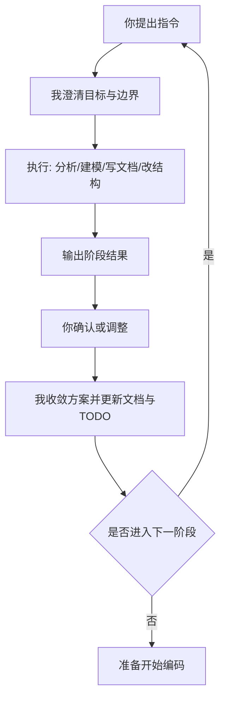
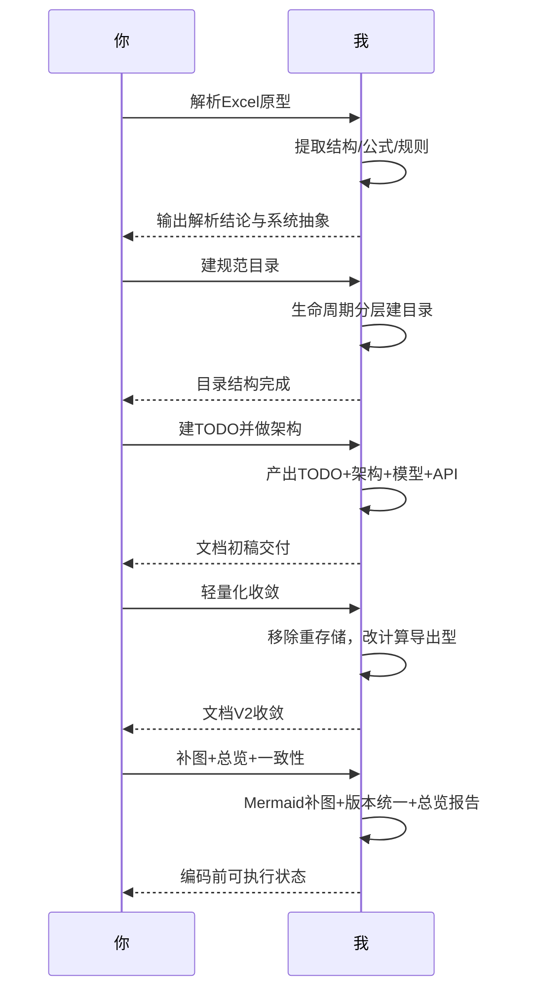
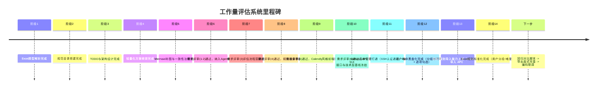
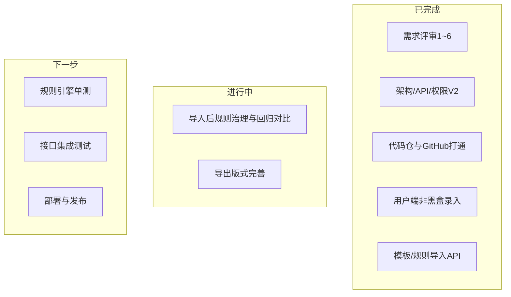

# 对话流程与里程碑总览

## 1. 文档目的

用于持续记录你与我在本项目中的协作过程，重点沉淀：
- 你发出的关键指令
- 我的处理思路与执行动作
- 每一轮产出与反馈
- 项目推进步骤与里程碑演进

> 约定：后续每次对话在出现“阶段性成果”或“方向调整”时，更新本文件。

## 2. 协作总流程（Mermaid）

## 3. 已完成阶段回顾

## 阶段 1：解析评估 Excel 原型
- 你的指令：先全面解析评估 Excel，后续作为系统原型讨论基础。
- 我的处理思路：
  - 先做结构解析（工作表、字段、公式、校验规则）。
  - 把公式逻辑抽象成“可产品化规则链”。
- 阶段产出：
  - 完整解析结论（含关键计算链路）。
  - 识别出模板化系统的核心能力：模板、规则、计算、导出。

## 阶段 2：建立项目规范目录
- 你的指令：在项目路径下创建一套规范文件夹。
- 我的处理思路：
  - 按产品生命周期分层（治理/需求/设计/开发/测试/部署/运维/复盘）。
- 阶段产出：
  - 完整目录框架，支持后续文档分门别类沉淀与回溯。

## 阶段 3：建立 TODO 并开始架构设计
- 你的指令：创建 todolist，并结合需求做架构设计。
- 我的处理思路：
  - 先建执行型 TODO，再落架构初稿。
  - 从业务抽象到技术选型逐层展开。
- 阶段产出：
  - 项目 TODO
  - 架构设计文档初版
  - 数据模型/API/权限文档初版

## 阶段 4：需求变更，收敛为轻量系统
- 你的指令：坚持轻量化，不做过多后端存储，评估后导出即结束。
- 我的处理思路：
  - 把系统从“项目管理型”收敛到“计算导出型”。
  - 移除重持久化对象（项目、快照、复杂审计）。
  - 保留模板/规则文件化 + 导出留痕。
- 阶段产出：
  - 架构/模型/API 文档全面改版（轻量原则）。
  - TODO 同步收敛。

## 阶段 5：补 Mermaid 与一致性治理
- 你的指令：给前述文档补 Mermaid 图，并继续一致性巡检。
- 我的处理思路：
  - 关键文档补图（架构图、关系图、时序图、实施图）。
  - 扫描版本冲突并统一命名。
  - 输出编码前总览报告。
- 阶段产出：
  - 核心文档图示化完成。
  - 核心文档统一为 V2 命名。
  - 编码前总览与确认清单。

## 4. 指令 -> 处理 -> 反馈（时序图）

## 5. 项目里程碑（Mermaid）

## 6. 当前状态（编码前）

- 已完成：文档体系、技术方案、执行清单、版本统一、可视化补图。
- 待确认（进入编码前最后一步）：
  - 模板 JSON 字段冻结
  - 规则口径冻结（用户数/难度/多组织）
  - 导出版式确认（Excel/PDF）

## 7. 后续更新规则（执行约定）

每次对话后，满足以下任一条件即更新本文件：
- 新增阶段性文档或关键产物
- 需求方向发生调整
- 里程碑状态变化
- 准备进入下一实施阶段（如编码、联调、上线）

## 8. 最新进展（本轮新增）

- 已完成“需求评审 1：产品目标层”确认。
- 已完成“需求评审 2：业务能力层”确认（全部同意）。
- 已确认 Agent 兼容方向：
  - V1：API 可调用 + 结果可解释 + 幂等/限流/requestId
  - V1.1：需求文档自动抽取参数
- 已确认评估流程层（3.1~3.5）：版本必选、校验规则、后端权威、META+requestId、导出 TTL 7 天可配
- 已确认计算规则层采用可配置抽象：`grouping`、`itemRule`、`baseRule`、`orgIncrementRule`（口径变更不改代码）
- 已确认页面交互 5.1~5.4；前端采用 Calendly 极简风格，规范见 `02_产品设计/前端视觉规范-Calendly风格-V2.md`
- 需求评审 6（接口与技术层）已确认：`API接口设计-V2.md` §14 标题为「评审已确认」；登录示例角色为 `operator`、计算响应示例含 `ruleVersion`/`pipelineVersion` 等追溯字段
- 已完成 GitHub 版本管理接通：本地仓库初始化、远程 `origin` 绑定 `mjlkevin/Workload-evaluation-system`、SSH Key 配置完成并成功推送 `main`
- 已落实设计变更：用户端不再黑盒，估算录入页支持按模板展示 `group -> item` 全量结构，并支持逐项勾选/反勾选、全选/全不选与本地分组小计预览
- 已完成结果解释增强：KPI卡片、增量解释、分组/单项明细、requestId与结果JSON复制；并补充规则配置只读摘要面板（pipeline/用户分段/难度枚举/多组织规则）
- 已完成模板/规则导入能力首版：新增 `POST /api/v1/templates/import-excel`、`POST /api/v1/templates/import-json`、`POST /api/v1/rule-sets/import-json`，导入后自动刷新为当前配置源文件
- 已完成 Excel 规则标准化首版：新增 `npm run rules:standardize` 脚本，从原始 Excel 单元格公式抽取用户数分段（F211）、多组织系数（G215），并写回规则配置
- 已补充规则回归脚本：新增 `npm run rules:regression`，覆盖用户分段边界值与多组织增量公式的规则级对比校验
- 已补充 Excel 回归报告脚本：新增 `npm run rules:excel-report`，输出 `excel-regression-report.md/json`，当前样本场景对比结论为 PASS
- 已补充核心 API 集成校验脚本：新增 `npm run test:api:integration`，覆盖健康检查、模板/规则查询、计算校验与导出幂等回放
- 已完成规则引擎 pipeline 化运行时接入：API 已改为复用 `engine.ts`，按 `pipeline` 控制 `itemRule/baseRule/orgIncrementRule` 阶段是否执行
- 已完成会话态估算与最小访问控制：新增 `POST /api/v1/sessions/start`、`POST /api/v1/sessions/{id}/calculate`；新增基于 `X-Role` 的轻量 RBAC（导入接口限 admin）
- 已完成评估页面 UI/UX 精细化调整（前端 `apps/web/src/App.vue`）：
  - 优化 sticky 容器与 header 间距（`padding-top: 2px`），消除滚动时内容透穿问题
  - 重构树形卡片收起状态：隐藏 `h3` 避免重复，主题色高亮 `strong`，右置展开按钮，压缩整体高度
  - 模块报价页面 4 列表头布局：SKU | 实施要点 | 评估说明 | 操作（复选框+人天）
  - 提取表头标题统一前置，内容区移除"实施要点:"和"评估说明:"前缀文本
  - 新增 `isTableLayoutSheet` 计算属性，将 4 列布局应用到所有套件工作表（模块报价、NEW金蝶AI超级套件、套件报价-AI星空基础套件）
  - 统一各工作表数据层级（跳过应用分组，直接 SKU → Items），确保布局一致性
  - 细节优化：SKU div 添加阴影区分、表头与内容垂直居中对齐、form label 2行3列布局节省高度
- 已完成预置选择模式首版联动：
  - 新增并接通 `简单纯财`、`标准财务供应链`、`标准财务供应链生产(制造)` 与 Excel 样本的一键命中（云产品 + SKU条目）
  - 预置模式改为互斥单选；支持未配置模式提示
- 已完成条目自定义与清空能力增强：
  - `+/-` 自定义按钮仅在条目已勾选时可用；未勾选时灰态禁用
  - 云产品头部新增 `清除`，可一键清空当前云产品下全部勾选
- 已完成折叠态信息增强：
  - 云产品卡片折叠后在“累计人天”右侧展示“已选SKU”横向摘要（超出省略）
- 已完成导航与页面结构扩展：
  - 侧栏支持折叠/展开（图标态、动画过渡、释放右侧横向空间）
  - 导航新增 `资源人天及成本` 独立页面入口（位于“评估”和“API”之间）
  - 顶栏移除 `Help` 与 `Upgrade Plan`
- 已完成评估吸顶区信息与布局优化：
  - `assessment-sticky-actions` 左侧新增标题“配置与实时预览”（字号与“评估模式”一致）
  - 吸顶容器再次压缩高度，释放更多纵向空间
  - 模块报价列宽再平衡：压缩“实施要点”，扩大并左对齐“评估说明”（含表头）

## 9. 里程碑地图速览（同步 TODO）

> 详细里程碑地图与甘特图以 `00_项目治理/里程碑与计划/项目开发TODO.md` 为准；本节保留摘要视图，便于会话中快速对齐。

### 9.1 关键路径（摘要）

### 9.2 当前推进状态（摘要）

